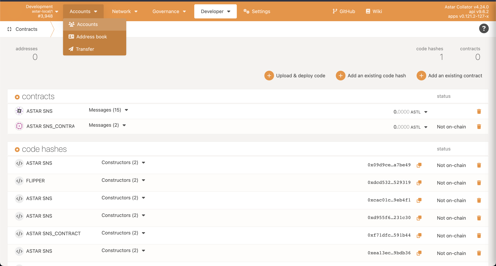
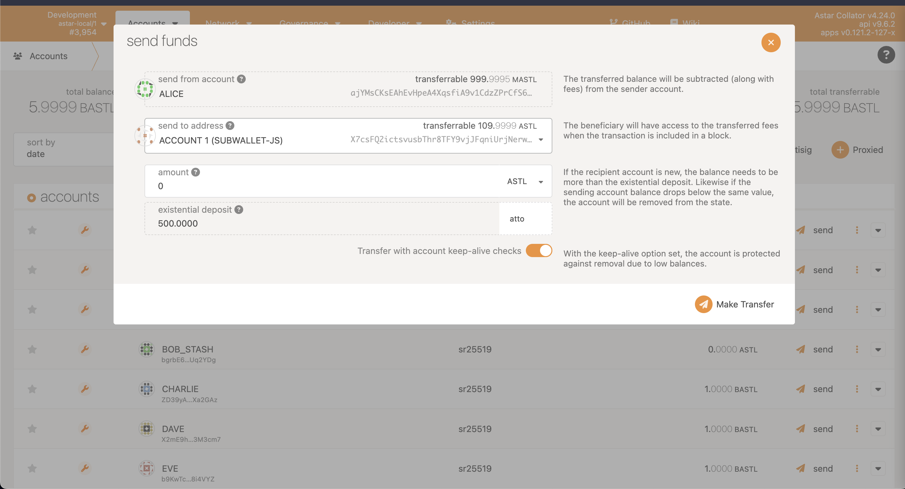
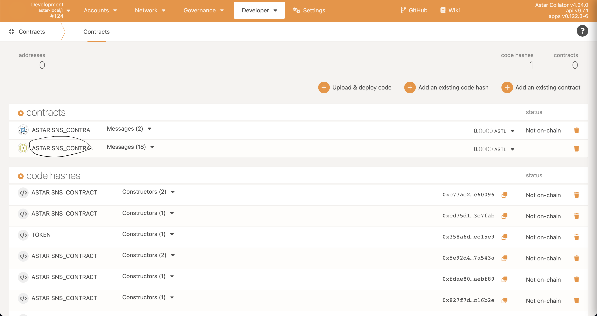
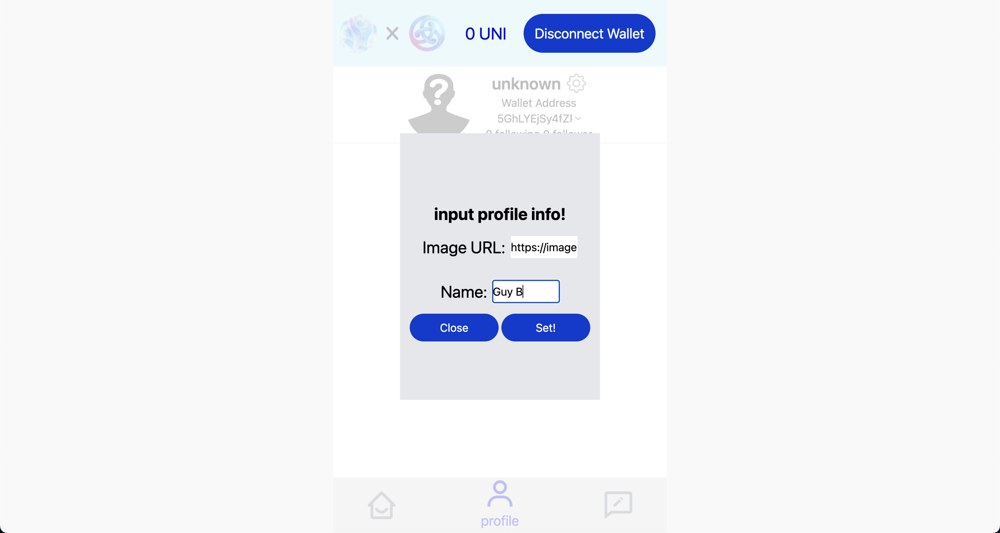
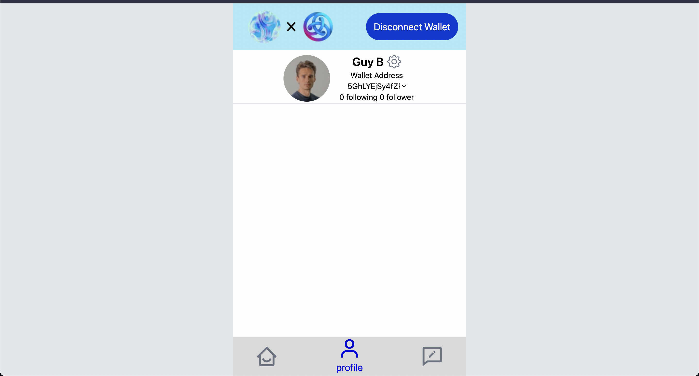
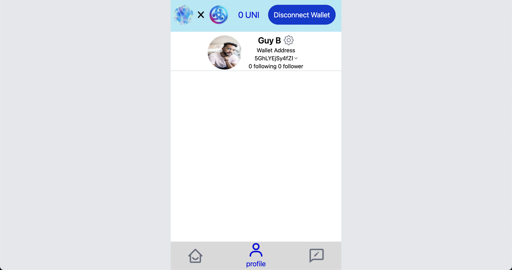
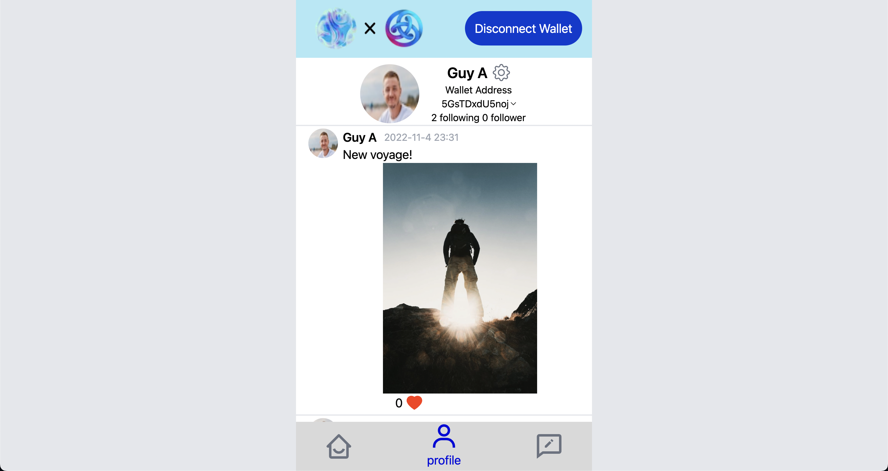
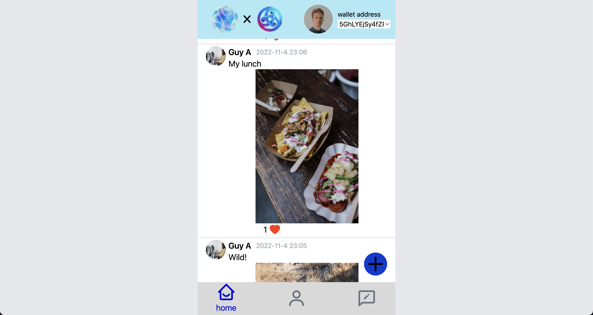
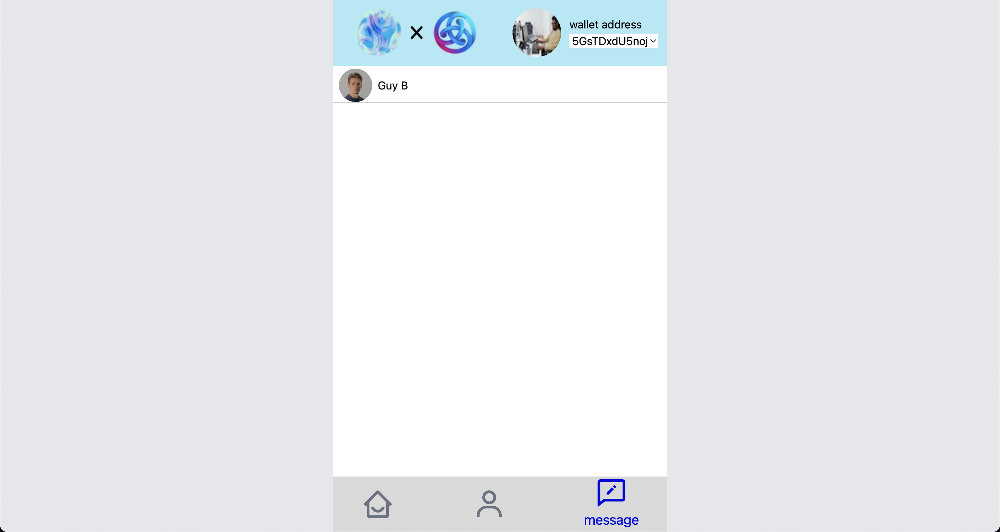
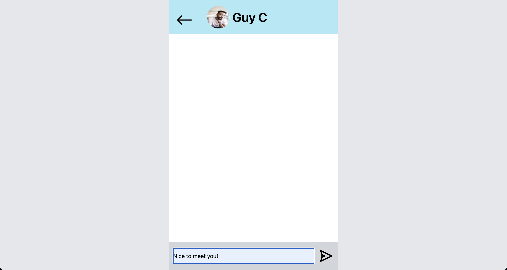

## 🧪 作成したアプリの動作を確認しよう

ここまでのレッスンで全ての実装は完成しました！

ここからはローカルでデプロイして動作確認を行なっていきましょう！

その前に留意しておいていただきたいことがあります。フロントで用意しているボタンなどを押してもきちんとコントラクトに反映されない場合があります。これはgaslimitが足りないことが原因であることが多いです。

試しにpolkado.jsでコントラクトと直接やり取りをしてうまくいくようでしたらさらにこれが原因である可能性が高いです。そのような場合はpolkadot.jsに記載されているgaslimitの倍くらいをフロントの方に記載してみるとうまくいくことがあります。

ではコントラクトをデプロイするためのノードを立てるから始めていきます。まずはセクション1で行なった

1. Astarのローカルノードを立てる(`./astar-collator --dev`コマンド)
2. フロント用のローカルノードを立てる(`yarn client dev`コマンド)
   を行いましょう。

1.は具体的に下のような手順で行います。

まずはコントラクトを記述した`packages/contract`ディレクトリへ移動した後、下のコマンドを実行してastarのローカルノードを立てます。

```
./astar-collator --dev
```

次に[polkadot.js](https://polkadot.js.org/apps/?rpc=wss%3A%2F%2Frpc.polkadot.io#/explorer)で先ほど作成した`wasmファイル,metadata.jsonファイル`をアップロードします。

詳しい手順に関しては環境構築のほうで述べているのでそちらを参考にしてみてください。

これでデプロイができたら下の画像のようにデプロイしたコントラクトの名前がでてくると思います


polkadot.jsでは新しくデプロイしたものほど下にくるので、一番下のコントラクトが先ほどデプロイしたものとなります。

皆さんの場合は環境構築でデプロイしたものと先ほどデプロイしたものしかないので、Messagesという部分を見れがその数が違うのですぐに違いがわかるかと思います。

Messagesにはpolkadot.js上から呼べる関数の一覧が載っていて、実装しただけ関数の数が最初に比べて多くなっているはずです。

2.については先ほど作成したフロントエンドのターミナルで`yarn client dev`コマンドを行いましょう！

次にセクション1 ーレッスン4の最後の部分で作ったウォレットアドレスにローカルで使う用のトークンを送信ましょう！

下のように`Polkadot.js`の`Accounts`ボタンを押すとアカウントのリストが出てきます。

その中からAliceというアカウントに大量のトークンが入っているので、そこから自分作成したアドレスに10 ASTLほど送りましょう。

これをしないとトランザクションで使用するトークンが不足してきちんと関数が動きません。




これでコントラクトとフロントの接続をする準備のために後1つやることがあります。それはフロントエンドのコードの`.env`にコントラクトのアドレスを代入することです！

`Polkadot.js`でコントラクトアドレスを確認して下のように代入しましょう（NEXT_PUBLIC_UNKNOWN_IMAGE_URLには実際の画像のURLを入れる）!

[`.env`]

```
NEXT_PUBLIC_CONTRACT_ADDRESS=WCpkcJenKkFZwk2tot1yhyvZuwFXD2xdzb7dyn2WMebKtC6
NEXT_PUBLIC_UNKNOWN_IMAGE_URL="https://images.unsplash.com/..."
```




では早速ローカルで立てたノードが作った[サイト](`http://localhost:3000/`)を開いてみましょう！

※設計上、画面遷移するごとにリロードしないときちんと動きません。UX的に悪く申し訳ないです 🙇

※何か問題や予想外のことが発生した場合はまずは以下の2つを行ってみてください。

1. 実行した関数のガス代が十分か`Poldkadot.js`で確認
2. リロードしてみる

まずウォレットコネクト画面を開くと`Connect Wallet`ボタンが出てくるはずです。

これによってホーム画面に遷移するとウォレットへのサインインを求められるはずです。

これは毎回いいねの数に従ったトークン付与の関数が裏で動いているからです！

ではプロフィールの設定をまずは試してみるためにプロフィール画面へ移動してみましょう。

移動してリロードするとまずはサインインを求められるはずです。ここでは接続しているアカウントに紐づくプロフィールがまだ存在しないためプロフィールの作成を求められます。

すると`unknown`という名前で登録されるはずです（もう一度リロードをする必要がある場合があります）。これが初期の設定です。

次に歯車マークをクリックしてプロフィールの名前と画像を設定してみましょう！

[unsplash](https://unsplash.com/)上から画像を探してURLをコピーして貼り付けましょう。その後名前を設定して`set`ボタンを押してみましょう！




同じように2つ目, 3つ目のアカウントも作成しておきましょう。

新しいアカウントはヘッダーにあるアカウント一覧が見れるトグルをクリックしてすることで作成できます！

ここで注意なのが新しいアカウントを作成するのは必ずプロフィール画面で行わないといけないということです。ホーム画面でやってしまうとプロフィールを作成する前に投稿のいいね数に従ってトークンを配布する関数が動いてしまいエラーになってしまうからです。

きちんとできていれば下のようになっているはずです。




では次に右下のボタンを押してみましょう。投稿モーダルが出てくるはずです。

次にモーダル内でURL、投稿内容を設定して投稿してみましょう。




では次に他のアカウントのアイコンをクリックしてフォローしてみましょう。

プロフィール画面に戻ると下のようにフォロー数とフォロワー数が増えているはずです。また、そのアカウントで投稿したものがみれるはずです。


では次にメッセージ画面に移動してみましょう！

この画面には下のようにフォローした、またはフォローされたアカウントとのメッセージ欄があるはずです。



ではこのメッセージ欄をクリックして遷移先でメッセージを入力してみましょう。



※設計上、メッセージを送信後一度前の画面に戻ってから再びそのメッセージルームに入らないとメッセージが更新されなくなっています 🙇

下の画像のようになっていればOKです！




これで期待している挙動は確認できましたね！ テストは成功です！

### 🙋‍♂️ 質問する

わからないことがあれば、Discordの`#astar`でsection・Lesson名とともに質問をしてください 👋

---

## 次のセクションでは完成したフロントエンドをデプロイしましょう! 🎉
