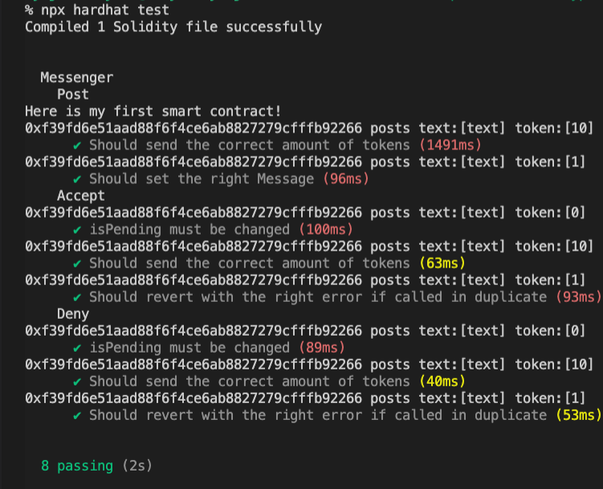

### 🚀 コントラクトにメッセージの確認機能を加えましょう

ここまででメッセージの投稿と、投稿されたメッセージを参照するところまで実装をしました。
このレッスンではメッセージの確認機能を追加します。
確認とは
「メッセージトークンの受け取りを承諾する、または拒否する」
ことを意味します。

それでは`Messenger.sol`内に以下の機能を追加してください。

```diff
// Messenger.sol
// SPDX-License-Identifier: MIT

pragma solidity ^0.8.17;

import "hardhat/console.sol";

contract Messenger {
    // ...

    // ユーザからメッセージを受け取り、状態変数に格納します。
    function post(string memory _text, address payable _receiver){
		// ...
    }

+    // メッセージ受け取りを承諾して、AVAXを受け取ります。
+    function accept(uint256 _index) public {
+        //指定インデックスのメッセージを確認します。
+        _confirmMessage(_index);
+
+        Message memory message = _messagesAtAddress[msg.sender][_index];
+
+        // メッセージの受取人にavaxを送信します。
+        _sendAvax(message.receiver, message.depositInWei);
+    }
+
+    // メッセージ受け取りを却下して、AVAXをメッセージ送信者へ返却します。
+    function deny(uint256 _index) public payable {
+        _confirmMessage(_index);
+
+        Message memory message = _messagesAtAddress[msg.sender][_index];
+
+        // メッセージの送信者にavaxを返却します。
+        _sendAvax(message.sender, message.depositInWei);
+    }
+
+    function _confirmMessage(uint256 _index) private {
+        Message storage message = _messagesAtAddress[msg.sender][_index];
+
+        // 関数を呼び出したアドレスとメッセージの受取人アドレスが同じか確認します。
+        require(
+            msg.sender == message.receiver,
+            "Only the receiver can _confirmMessage the message"
+        );
+
+        // メッセージが保留中であることを確認します。
+        require(
+            message.isPending == true,
+            "This message has already been confirmed"
+        );
+
+        // メッセージの保留状態を解除します。
+        message.isPending = false;
+    }
+
+    function _sendAvax(address payable _to, uint256 _amountInWei) private {
+        (bool success, ) = (_to).call{value: _amountInWei}("");
+        require(success, "Failed to withdraw AVAX from contract");
+    }

    // ユーザのアドレス宛のメッセージを全て取得します。
    function getOwnMessages() public view returns (Message[] memory) {
        return _messagesAtAddress[msg.sender];
    }
}
```

それでは追加した部分を見ていきましょう。

```
    // メッセージ受け取りを承諾して、AVAXを受け取ります。
    function accept(uint256 _index) public {
        //指定インデックスのメッセージを確認します。
        _confirmMessage(_index);

        Message memory message = _messagesAtAddress[msg.sender][_index];

        // メッセージの受取人にavaxを送信します。
        _sendAvax(message.receiver, message.depositInWei);
    }
```

ここではメッセージの承諾を行っています。
あなたがこの関数を呼び出す場合、
あなた宛のメッセージが格納された配列(`_messagesAtAddress[あなたのアドレス]`で取得できるもの)の中のどのメッセージを承諾するかを、配列のインデックス番号を引数として指定することで伝えます。

`_index`を受け取った後、`_confirmMessage`でメッセージの確認作業に必要な処理を済ませます。

次に、メッセージの受取人(ここでは`msg.sender`)と`_index`を指定し該当メッセージを取得します。

取得したメッセージの情報を元にメッセージトークンを送信するため`_sendAvax`を呼び出します。
メッセージトークンはメッセージの投稿時に既にコントラクトへ送信されているため、
ここではコントラクトからメッセージの受取人に対してメッセージトークンを送信します。

`_confirmMessage`、`_sendAvax`に関してはこの後処理を見ていきます。

メッセージを拒否する関数`deny`に関しても`accept`とほとんど同じ処理をしていますが、
メッセージトークンの送信先がメッセージの送信者となっている部分が違います。
該当箇所 -> `_sendAvax(message.sender, message.depositInWei);`

```
    function _confirmMessage(uint256 _index) private {
        Message storage message = _messagesAtAddress[msg.sender][_index];

        // 関数を呼び出したアドレスとメッセージの受取人アドレスが同じか確認します。
        require(
            msg.sender == message.receiver,
            "Only the receiver can _confirmMessage the message"
        );

        // メッセージが保留中であることを確認します。
        require(
            message.isPending == true,
            "This message has already been confirmed"
        );

        // メッセージの保留状態を解除します。
        message.isPending = false;
    }
```

ここではメッセージの確認作業に必要な処理をしています。

はじめに`_messagesAtAddress`にアクセスして該当メッセージの情報を取得しています。
返り値は`Message storage message`によって`storage`を指定して受け取っています。
`storage`はブロックチェーン上に永久に格納される変数を表します。
変数の内容を変更してブロックチェーン上に反映させたい場合は`storage`を使ってアクセスします。

2つの`require`を使用して、メッセージの確認条件を確かめています。
条件を確かめた後、メッセージを保留していない状態に変更します。

> 📓 `require`とは
> 何らかの条件が`true`もしくは`false`であることを確認する`if`文のような役割を果たします。
> もし`require`の結果が`false`の場合（＝コントラクトが持つ資金が足りない場合）は、トランザクションをキャンセルします。

```
    function _sendAvax(address payable _to, uint256 _amountInWei) private {
        (bool success, ) = (_to).call{value: _amountInWei}("");
        require(success, "Failed to withdraw AVAX from contract");
    }
```

`_sendAvax`は指定されたアドレスへ指定された量のトークンを移動しています。
トークンの送信先のアドレスに対して`call`という関数を呼ぶことで送信ができます。
`call`を呼ぶためにはアドレスが`payable`である必要があります。

### 🧪 テストを追加しよう

それでは追加した機能に対してテストを書いていきます。
`test`ディレクトリ内の`Messenger.ts`に以下のコードを追加してください。

```diff
// ...

describe('Messenger', function () {
  async function deployContract() {
    // ...
  }

  describe('Post', function () {
    // ...
  });

+  describe('Accept', function () {
+    it('isPending must be changed', async function () {
+      const { messenger, otherAccount } = await loadFixture(deployContract);
+      const first_index = 0;
+
+      await messenger.post('text', otherAccount.address);
+      let messages = await messenger.connect(otherAccount).getOwnMessages();
+      expect(messages[0].isPending).to.equal(true);
+
+      await messenger.connect(otherAccount).accept(first_index);
+      messages = await messenger.connect(otherAccount).getOwnMessages();
+      expect(messages[0].isPending).to.equal(false);
+    });
+
+    it('Should send the correct amount of tokens', async function () {
+      const { messenger, otherAccount } = await loadFixture(deployContract);
+      const test_deposit = 10;
+
+      await messenger.post('text', otherAccount.address, {
+        value: test_deposit,
+      });
+
+      // メッセージをacceptした場合は、コントラクト(messenger)から受取人(otherAccount)へ送金されます。
+      const first_index = 0;
+      await expect(
+        messenger.connect(otherAccount).accept(first_index)
+      ).to.changeEtherBalances(
+        [messenger, otherAccount],
+        [-test_deposit, test_deposit]
+      );
+    });
+
+    it('Should revert with the right error if called in duplicate', async function () {
+      const { messenger, otherAccount } = await loadFixture(deployContract);
+
+      await messenger.post('text', otherAccount.address, { value: 1 });
+      await messenger.connect(otherAccount).accept(0);
+      await expect(
+        messenger.connect(otherAccount).accept(0)
+      ).to.be.revertedWith('This message has already been confirmed');
+    });
+  });
+
+  describe('Deny', function () {
+    it('isPending must be changed', async function () {
+      const { messenger, otherAccount } = await loadFixture(deployContract);
+      const first_index = 0;
+
+      await messenger.post('text', otherAccount.address);
+      let messages = await messenger.connect(otherAccount).getOwnMessages();
+      expect(messages[0].isPending).to.equal(true);
+
+      await messenger.connect(otherAccount).deny(first_index);
+      messages = await messenger.connect(otherAccount).getOwnMessages();
+      expect(messages[0].isPending).to.equal(false);
+    });
+
+    it('Should send the correct amount of tokens', async function () {
+      const { messenger, owner, otherAccount } = await loadFixture(
+        deployContract
+      );
+      const test_deposit = 10;
+
+      await messenger.post('text', otherAccount.address, {
+        value: test_deposit,
+      });
+
+      // メッセージをdenyした場合は、コントラクト(messenger)から送信者(owner)へ送金されます。
+      const first_index = 0;
+      await expect(
+        messenger.connect(otherAccount).deny(first_index)
+      ).to.changeEtherBalances(
+        [messenger, owner],
+        [-test_deposit, test_deposit]
+      );
+    });
+
+    it('Should revert with the right error if called in duplicate', async function () {
+      const { messenger, otherAccount } = await loadFixture(deployContract);
+
+      await messenger.post('text', otherAccount.address, { value: 1 });
+      await messenger.connect(otherAccount).deny(0);
+      await expect(messenger.connect(otherAccount).deny(0)).to.be.revertedWith(
+        'This message has already been confirmed'
+      );
+    });
+  });
});

```

追加内容を確認しましょう。

`Accept`のテストケースに関して注目して1つずつテストを見てきます。

```ts
describe('Accept', function () {
  it('isPending must be changed', async function () {
    const { messenger, otherAccount } = await loadFixture(deployContract);
    const first_index = 0;

    // ownerがotherAccount.addressを受取人にしてメッセージをpost
    await messenger.post('text', otherAccount.address);
    let messages = await messenger.connect(otherAccount).getOwnMessages();
    // post直後のメッセージは保留中なのでisPendingはtrueです。
    expect(messages[0].isPending).to.equal(true);

    // otherAccountが先ほどのメッセージをaccept
    await messenger.connect(otherAccount).accept(first_index);
    messages = await messenger.connect(otherAccount).getOwnMessages();
    // accept後はメッセージが保留中ではないことを確認します。
    expect(messages[0].isPending).to.equal(false);
  });

  // ...
});
```

はじめにコントラクトがデプロイされたチェーンの用意と、`owner`から`otherAccount`に対してメッセージの`post`を行います。
`otherAccount`が自分宛のメッセージに対して`accept`をした後、メッセージの`isPending`の内容が正しく変更されているかを確認しています。

```ts
describe('Accept', function () {
  // ...

  it('Should send the correct amount of tokens', async function () {
    const { messenger, otherAccount } = await loadFixture(deployContract);
    const test_deposit = 10;

    await messenger.post('text', otherAccount.address, {
      value: test_deposit,
    });

    // メッセージをacceptした場合は、コントラクト(messenger)から受取人(otherAccount)へ送金されます。
    const first_index = 0;
    await expect(
      messenger.connect(otherAccount).accept(first_index)
    ).to.changeEtherBalances(
      [messenger, otherAccount],
      [-test_deposit, test_deposit]
    );
  });

  // ...
});
```

こちらもはじめに1つ目のテストと同じく`otherAccount`宛のメッセージを作成するところまで行います。
`otherAccount`がメッセージを`accept`した後にメッセージトークンが正しく送信されているかを確認しています。

```ts
describe('Accept', function () {
  // ...

  it('Should revert with the right error if called in duplicate', async function () {
    const { messenger, otherAccount } = await loadFixture(deployContract);

    await messenger.post('text', otherAccount.address, { value: 1 });
    await messenger.connect(otherAccount).accept(0);
    await expect(messenger.connect(otherAccount).accept(0)).to.be.revertedWith(
      'This message has already been confirmed'
    );
  });
});
```

こちらは`otherAccount`がメッセージを2度`accept`した際に、
正しくリバートするか（トランザクションがキャンセルされるか）を確認しています。
2度`accept`ができてしまうとメッセージの受取人が1つのメッセージから複数回トークンを受け取ることができてしまうためサービスとして成立しません。
このテストは`Messenger`コントラクトの`_confirmMessage`関数内の`require`が正しく機能しているかを確認しています。

```ts
await expect(関数呼び出し).to.be.revertedWith('リバート時のメッセージ');
```

とすることでトランザクションがキャンセルされた際のメッセージも検証することができます。
実際に`'This message has already been confirmed'`は、`_confirmMessage`関数内で既に指定してします。

続く`Deny`に関するテストも`Accept`と同じようなテストを実装しています。

それではテストを実行しましょう！

ターミナル上で`AVAX-Messenger/`直下にいることを確認し、以下のコマンドを実行してください。

```
yarn test
```

以下のような表示がされたらテスト成功です！



### 🙋‍♂️ 質問する

ここまでの作業で何かわからないことがある場合は、Discordの`#avalanche`で質問をしてください。

ヘルプをするときのフローが円滑になるので、エラーレポートには下記の3点を記載してください ✨

```
1. 質問が関連しているセクション番号とレッスン番号
2. 何をしようとしていたか
3. エラー文をコピー&ペースト
4. エラー画面のスクリーンショット
```

---

次のレッスンでコントラクトにまだ実装できていない機能を実装しましょう 🎉
