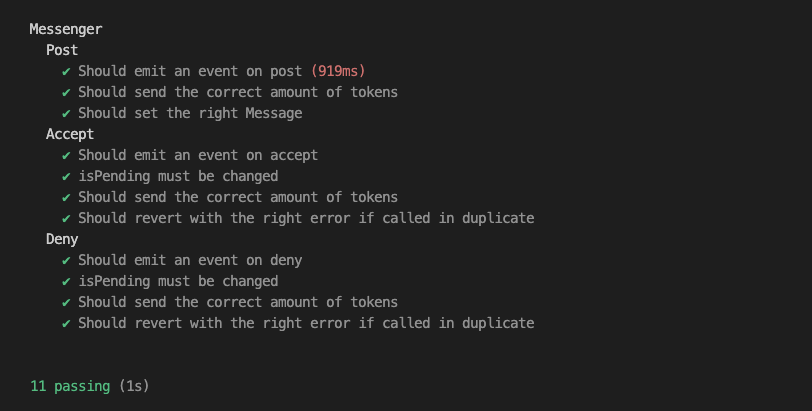

### 🐣 コントラクトにイベントを追加しましょう

これまでのレッスンで、コントラクトに必要な機能が揃ってきました。
このレッスンではコントラクトにイベント機能を実装します。

solidityにおけるイベントとは、コントラクトの状態について呼び出し側のアプリケーションに通知する機能のことです。
つまりコントラクトである処理が完了した場合や何か事象が発生した場合にその旨をフロントエンド側に伝えることができます。

イベントを実装してその理解を深めていきましょう！

`contracts`ディレクトリ内の`Messenger.sol`を編集していきます。

まずコントラクト内にイベントを定義します。

```diff
contract Messenger {
    // メッセージ情報を定義します。
    struct Message {
        address payable sender;
        address payable receiver;
        uint256 depositInWei;
        uint256 timestamp;
        string text;
        bool isPending;
    }

    // メッセージの受取人アドレスをkeyにメッセージを保存します。
    mapping(address => Message[]) private _messagesAtAddress;

+    event NewMessage(
+        address sender,
+        address receiver,
+        uint256 depositInWei,
+        uint256 timestamp,
+        string text,
+        bool isPending
+    );
+
+    event MessageConfirmed(address receiver, uint256 index);

    constructor() payable {
        console.log("Here is my first smart contract!");
    }

    // ...
}
```

各イベントには引数を渡せるようになっています。
この引数によりフロントエンド側に情報を伝えることができます。
それぞれの役割をまとめます。

- `NewMessage`: 新しいメッセージが作成されたことを伝えます。そのため引数には新しく作成されたメッセージの情報を渡せるようにしています。
- `MessageConfirmed`: メッセージが確認（承諾or拒否）されたことを伝えます。受取人とそのメッセージ配列のindex番号を渡せるようにしています。

それでは定義したイベントを実際にフロントエンドへ伝える部分を実装します。
各`post`、`accept`、`deny`関数に以下のコードを追加してください。

```diff
    // ユーザからメッセージを受け取り、状態変数に格納します。
    function post(string memory _text, address payable _receiver)
        public
        payable
    {
        console.log(
            "%s posts text:[%s] token:[%d]",
            msg.sender,
            _text,
            msg.value
        );

        _messagesAtAddress[_receiver].push(
            Message(
                payable(msg.sender),
                _receiver,
                msg.value,
                block.timestamp,
                _text,
                true
            )
        );

+        emit NewMessage(
+            msg.sender,
+            _receiver,
+            msg.value,
+            block.timestamp,
+            _text,
+            true
+        );
    }
```

```diff
    // メッセージ受け取りを承諾して、AVAXを受け取ります。
    function accept(uint256 _index) public {
        //指定インデックスのメッセージを確認します。
        _confirmMessage(_index);

        Message memory message = _messagesAtAddress[msg.sender][_index];

        // メッセージの受取人にavaxを送信します。
        _sendAvax(message.receiver, message.depositInWei);

+        emit MessageConfirmed(message.receiver, _index);
    }
```

```diff
    // メッセージ受け取りを却下して、AVAXをメッセージ送信者へ返却します。
    function deny(uint256 _index) public payable {
        _confirmMessage(_index);

        Message memory message = _messagesAtAddress[msg.sender][_index];

        // メッセージの送信者にavaxを返却します。
        _sendAvax(message.sender, message.depositInWei);

+        emit MessageConfirmed(message.receiver, _index);
    }
```

`emit`と共に先ほど定義したイベントを使用しているのがわかるでしょうか。
`emit`によりイベントを発生させ、フロントエンド側で発生したイベントを認知することができます。
フロントエンドは次のセクションで実装していきますが、まずはテストでその挙動を確認しましょう。

### 🧪 テストを追加しよう

`test`ディレクトリ内の`Messenger.ts`にコードを追加します。
各`Post`、`Accept`、`Deny`のテストケースに以下のテストを追加してください。

```diff
  describe('Post', function () {
+    it('Should emit an event on post', async function () {
+      const { messenger, otherAccount } = await loadFixture(deployContract);
+
+      await expect(messenger.post('text', otherAccount.address, { value: 1 }))
+        .to.emit(messenger, 'NewMessage')
+        .withArgs(
+          owner.address,
+          otherAccount.address,
+          1,
+          anyValue,
+          'text',
+          true,
+        );
+    });

    it('Should send the correct amount of tokens', async function () {
      // ...
    });

    it('Should set the right Message', async function () {
      // ...
    });
  });
```

```diff
  describe('Accept', function () {
+    it('Should emit an event on accept', async function () {
+      const { messenger, otherAccount } = await loadFixture(deployContract);
+      const test_deposit = 1;
+
+      await messenger.post('text', otherAccount.address, {
+        value: test_deposit,
+      });
+
+      const first_index = 0;
+      await expect(messenger.connect(otherAccount).accept(first_index))
+        .to.emit(messenger, 'MessageConfirmed')
+        .withArgs(otherAccount.address, first_index);
+    });

    it('isPending must be changed', async function () {
      // ...
    });

    it('Should send the correct amount of tokens', async function () {
      // ...
    });

    it('Should revert with the right error if called in duplicate', async function () {
      // ...
	});
  });
```

```diff
 describe('Deny', function () {
+    it('Should emit an event on deny', async function () {
+      const { messenger, otherAccount } = await loadFixture(deployContract);
+      const test_deposit = 1;
+
+      await messenger.post('text', otherAccount.address, {
+        value: test_deposit,
+      });
+
+      const first_index = 0;
+      await expect(messenger.connect(otherAccount).deny(first_index))
+        .to.emit(messenger, 'MessageConfirmed')
+        .withArgs(otherAccount.address, first_index);
+    });

    it('isPending must be changed', async function () {
      // ...
    });

    it('Should send the correct amount of tokens', async function () {
      // ...
    });

    it('Should revert with the right error if called in duplicate', async function () {
      // ...
    });
  });
```

それぞれ正しくイベントが発生したかどうかについて確認をしています。

```ts
expect(関数実行).to.emit(コントラクト, 'イベント名').withArgs(イベントの引数, ...);
```


とすることで指定したイベントが発生したのかをテストをすることができます。

`NewMessage`イベントの確認に使用している`anyValue`は、`@nomicfoundation/hardhat-chai-matchers/withArgs`に定義されている関数です。引数として受け取った値に関わらず常にtrueを返すため、引数の具体的な値をチェックせずにイベントを確認するために使用されます。ここでは、NewMessageイベントの引数のうち`block.timestamp`値に使用することで、この値をテストの対象外としています。

それでは、ファイルの先頭に以下のimport文を追加してください。

```ts
import { anyValue } from '@nomicfoundation/hardhat-chai-matchers/withArgs';
```

テストを実行する前に`Messenger`コントラクト内で定義していた`console.log`を削除しましょう。コンストラクタの動作はこれまでのテストですでに確認済みです。また、`post`関数で定義していたconsole.logは、イベントの発生をテストすることで確認できるため削除します。

まずはimport文を削除します。

```
// === 下記を削除 ===
import "hardhat/console.sol";
```

次に、コンストラクタ内のconsole.logを削除します。

```
        // === 下記を削除 ===
        console.log("Here is my first smart contract!");
```

最後にpost関数内のconsole.logを削除します。

```
        // === 下記を削除 ===
        console.log(
            "%s posts text:[%s] token:[%d]",
            msg.sender,
            _text,
            msg.value
        );
```

それではテストを実行しましょう！
ターミナル上で`AVAX-Messenger/`直下にいることを確認し、以下のコマンドを実行してください。

```
yarn test
```

以下のような表示がされたらテスト成功です！



### 🙋‍♂️ 質問する

ここまでの作業で何かわからないことがある場合は、Discordの`#avalanche`で質問をしてください。

ヘルプをするときのフローが円滑になるので、エラーレポートには下記の3点を記載してください ✨

```
1. 質問が関連しているセクション番号とレッスン番号
2. 何をしようとしていたか
3. エラー文をコピー&ペースト
4. エラー画面のスクリーンショット
```

---

おめでとうございます!
セクション1が終了しました!
ターミナルに出力されたアウトプットを`#avalanche`に投稿して、あなたの成功をコミュニティで祝いましょう 🎉
次のセクションに進みましょう!
