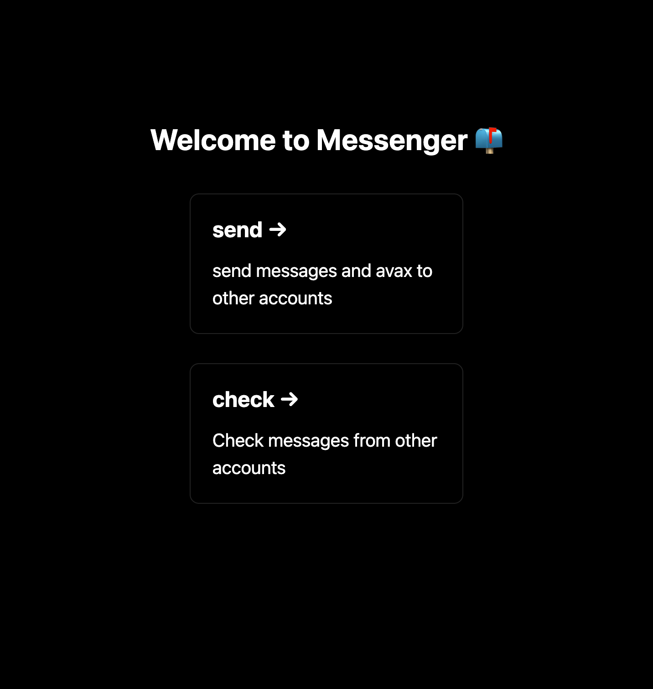
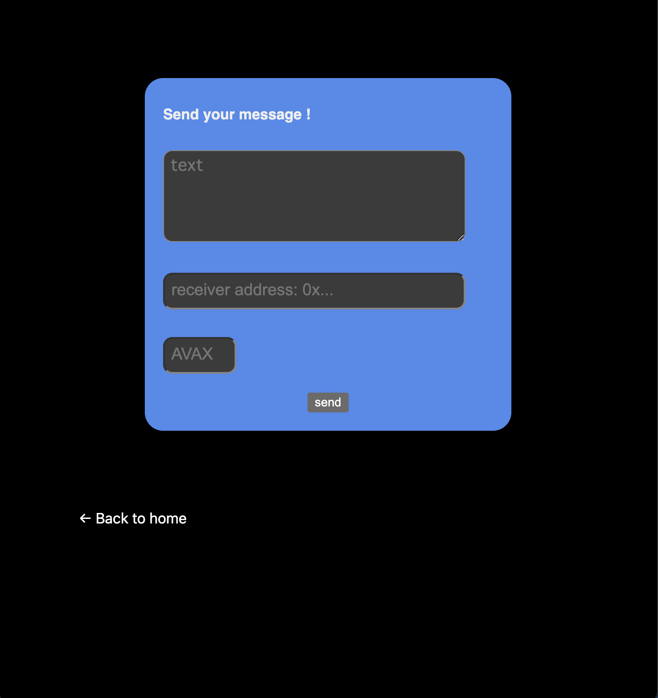
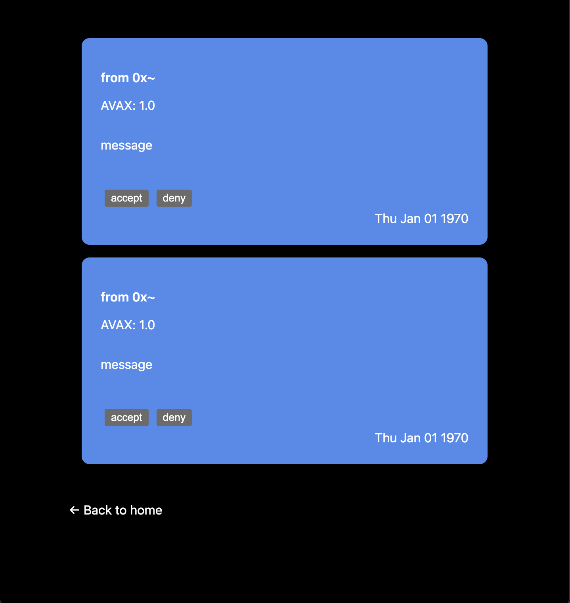

### 🍽 ページを作ろう

それでは実際にコードを書いてフロントエンドのベースとなるものを作成していきます。
先にこのレッスンでどのようなUIを作るのかイメージ図を載せます。
手順の中でイメージ図の何番という形で参照することになるのでこちらを参照するようにしてください。

1 \. ホーム画面



2 \. メッセージ送信画面



3 \. メッセージ確認画面



ここでは初期設定で存在すると想定されるファイルを削除・編集することがあります。
もし削除するファイルがあなたのフォルダ構成の中に無かった場合は、無視してください。
もし編集するファイルがあなたのフォルダ構成の中に無かった場合は、新たにファイルを作成し編集内容のコードをそのままコピーしてください。

### 📁 `styles`ディレクトリ

`styles`ディレクトリにはcssのコードが入っています。
全てのページに適用されるよう用意された`global.css`と、ホームページ用の`Home.module.css`があります。

`global.css`内に以下のコードを記述してください。
※初期設定のままなので編集箇所がない場合があります。

```css
html,
body {
  padding: 0;
  margin: 0;
  font-family: -apple-system, BlinkMacSystemFont, Segoe UI, Roboto, Oxygen, Ubuntu,
    Cantarell, Fira Sans, Droid Sans, Helvetica Neue, sans-serif;
}

a {
  color: inherit;
  text-decoration: none;
}

* {
  box-sizing: border-box;
}

@media (prefers-color-scheme: dark) {
  html {
    color-scheme: dark;
  }
  body {
    color: white;
    background: black;
  }
}
```

`Home.module.css`内を以下のコードに変更してください。

```css
.container {
  padding: 0 2rem;
}

.main {
  padding: 4rem 0;
  flex: 1;
  display: flex;
  flex-direction: column;
  justify-content: center;
  align-items: center;
}

.card {
  margin: 1rem;
  padding: 1.5rem;
  text-align: left;
  color: inherit;
  text-decoration: none;
  border: 1px solid #eaeaea;
  border-radius: 10px;
  transition: color 0.15s ease, border-color 0.15s ease;
  max-width: 300px;
}

.card:hover,
.card:focus,
.card:active {
  border-color: #0070f3;
}

.card h2 {
  margin: 0 0 1rem 0;
  font-size: 1.5rem;
}

.card h2:hover,
.card h2:focus,
.card h2:active {
  color: #0070f3;
  text-decoration: underline;
}

.card p {
  margin: 0;
  font-size: 1.25rem;
  line-height: 1.5;
}

@media (prefers-color-scheme: dark) {
  .card,
  .footer {
    border-color: #222;
  }
}
```

`styles`に関するフォルダ構成はこのようになります。

```
client
└── styles
    ├── Home.module.css
    └── globals.css
```

### 📁 `public`ディレクトリ

`Next.js`はルートディレクトリ直下の`public`ディレクトリを静的なリソース（画像やテキストデータなど）の配置場所と認識します。
そのためソースコード内で画像のURLを`/image.png`と指定した場合、
`Next.js`は自動的に`public`ディレクトリをルートとした`プロジェクトルート/public/image.png`を参照してくれます。

ディレクトリ内画像を全て削除してください。
そして新たに画像を追加します。

以下の画像をダウンロードするか、あなたのお好きな画像を`favicon.png`という名前で`public`ディレクトリ内に保存してください。


この画像はあなたのwebアプリケーションのファビコンとなります！ 🙆‍♂️

`public`に関するフォルダ構成はこのようになります。

```
client
└── public
    └── favicon.png
```

### 📁 `hooks`ディレクトリ

`client`ディレクトリ直下に`hooks`というディレクトリを作成しましょう。
こちらにはウォレットやコントラクトの状態を扱うようなカスタムフック(独自で作った[フック](https://ja.reactjs.org/docs/hooks-overview.html))を実装したファイルを保存します。

まだ具体的な実装はしませんが、`useMessengerContract.ts`という名前のファイルを作成し、以下のコードを記述してください。

```ts
import { BigNumber } from 'ethers';

export type Message = {
  sender: string;
  receiver: string;
  depositInWei: BigNumber;
  timestamp: Date;
  text: string;
  isPending: boolean;
};
```

`Message`という名前の型を定義しています。
`Message`はフロントエンドでメッセージを扱うためのオブジェクトの型を表しています。

`hooks`に関するフォルダ構成はこのようになります。

```
client
└── hooks
    └── useMessengerContract.ts
```

### 📁 `components`ディレクトリ

`client`ディレクトリ直下に`components`という名前のディレクトリを作成してください。
こちらにはコンポーネントを実装したファイルを保存していきます。

> 📓 コンポーネントとは
> UI（ユーザーインターフェイス）を形成する一つの部品のことです。
> コンポーネントはボタンのような小さなものから、ページ全体のような大きなものまであります。
> レゴブロックのようにコンポーネントのブロックで UI を作ることで、機能の追加・削除などの変更を容易にすることができます。

📁 `card`ディレクトリ

まず`components`ディレクトリ内に`card`というディレクトリを作成し、
その中に`MessageCard.module.css`と`MessageCard.tsx`という名前のファイルを作成してください。

`MessageCard.module.css`内に以下のコードを記述してください。

```css
.card {
  margin: 1rem;
  padding: 1.5rem;
  background-color: #4a8bed;
  border-radius: 10px;
}

p.title {
  font-weight: 600;
}

p.text {
  padding: 15px 0 0 0;
  min-height: 60px;
}

.date {
  text-align: right;
  margin: 0;
}

.container {
  display: flex;
}

.item {
  margin: 5px;
}
```

`MessageCard.tsx`で使用するcssになります。

`MessageCard.tsx`内に以下のコードを記述してください。

```tsx
import { ethers } from 'ethers';

import { Message } from '../../hooks/useMessengerContract';
import styles from './MessageCard.module.css';

type Props = {
  message: Message;
  onClickAccept: () => void;
  onClickDeny: () => void;
};

export default function MessageCard({
  message,
  onClickAccept,
  onClickDeny,
}: Props) {
  const depositInEther = ethers.utils.formatEther(message.depositInWei);

  return (
    <div className={styles.card}>
      <p className={styles.title}>from {message.sender}</p>
      <p>AVAX: {depositInEther}</p>
      <p className={styles.text}>{message.text}</p>
      {message.isPending && (
        <div className={styles.container}>
          <button className={styles.item} onClick={onClickAccept}>
            accept
          </button>
          <button className={styles.item} onClick={onClickDeny}>
            deny
          </button>
        </div>
      )}
      <p className={styles.date}>{message.timestamp.toDateString()}</p>
    </div>
  );
}
```

ここでは画像のイメージ図3の、ユーザが自分宛のメッセージを一覧で確認するページの部品を作っています。
一つ一つのメッセージの表示にこの`MessageCard`コンポーネントが使用されます。

ファイル内の初めには`Props`という形で`MessageCard`コンポーネントの引数を定義しています。
表示するメッセージの情報とコントラクトの`accept`、`deny`を呼び出すための関数を受け取ることになります。

関数の初めの一行に注目しましょう。

```ts
const depositInEther = ethers.utils.formatEther(message.depositInWei);
```

ここではメッセージトークン`message.depositInWei`(単位`Wei`)を
`ethers`の関数を利用して`depositInEther`(単位`ether`)に変換しています。
`depositInEther`はUIで実際に表示する数値になります。
solidityでは小数点を扱わないのでトークンの量は`Wei`を使用し、フロントエンドでも`Wei`を基準にメッセージトークンを認識しますが
実際にUIでトークンの量を表示する際はわかりやすい`ether`の単位に直したトークン量を使用することにします。

> 📓 TSX とは
> ファイル拡張子に typescript の ts ではなく、tsx というものをつけました。
> TSX は TypeScript の構文拡張で、使い慣れた HTML ライクな構文で UI を記述できるようになります。
> TSX の良いところは HTML と TypeScript 以外の新しい記号や構文をほとんど学ぶ必要がないことです。
> 実際にコードを書いて覚えていきましょう。

> 📓 `~.module.css`とは
> `module.css`を css ファイルの語尾に付けることで、`CSSモジュール`という`Next.js`の仕組みを利用することができます。
> `CSSモジュール`はファイル内のクラス名を元にユニークなクラス名を生成してくれます。
> 内部で自動的に行ってくれるので私たちがユニークなクラス名を直接使用することがありませんが、
> クラス名の衝突を気にする必要がなくなります。
> 異なるファイルで同じ CSS クラス名を使用することができます。
> 詳しくは[こちら](https://nextjs.org/docs/basic-features/built-in-css-support)をご覧ください。

📁 `form`ディレクトリ

次に`components`ディレクトリ内に`form`というディレクトリを作成し、
その中に`Form.module.css`と`SendMessageForm.tsx`という名前のファイルを作成してください。

`Form.module.css`内に以下のコードを記述してください。

```css
.container {
  align-items: center;
  display: flex;
  justify-content: center;
  height: 60vh;
}

.form {
  align-items: center;
  background-color: #4a8bed;
  border-radius: 20px;
  box-sizing: border-box;
  padding: 20px;
  width: 400px;
  justify-content: center;
}

.title {
  color: #eee;
  font-family: sans-serif;
  font-size: 16px;
  font-weight: 600;
  margin-top: 10px;
}

.form input {
  border-radius: 10px;
  margin-top: 30px;
}

.form textarea.text {
  border-radius: 10px;
  margin-top: 30px;
  width: 330px;
  height: 100px;
}

.form input.address {
  width: 330px;
  height: 40px;
}

.form input.number {
  width: 80px;
  height: 40px;
}

.form ::placeholder {
  font-size: 18px;
  padding: 0 0 0 5px;
}

.button {
  margin-top: 20px;
  text-align: center;
}
```

`SendMessageForm.tsx`内に以下のコードを記述してください。

```tsx
import { useState } from 'react';

import styles from './Form.module.css';

type Props = {
  sendMessage: (text: string, receiver: string, tokenInEther: string) => void;
};

export default function SendMessageForm({ sendMessage }: Props) {
  const [textValue, setTextValue] = useState('');
  const [receiverAccountValue, setReceiverAccountValue] = useState('');
  const [tokenValue, setTokenValue] = useState('0');

  return (
    <div className={styles.container}>
      <div className={styles.form}>
        <div className={styles.title}>Send your message !</div>
        <textarea
          name="text"
          placeholder="text"
          id="input_text"
          onChange={(e) => setTextValue(e.target.value)}
          className={styles.text}
        />

        <input
          name="address"
          placeholder="receiver address: 0x..."
          id="input_address"
          className={styles.address}
          onChange={(e) => setReceiverAccountValue(e.target.value)}
        />

        <input
          type="number"
          name="avax"
          placeholder="AVAX"
          id="input_avax"
          min={0}
          className={styles.number}
          onChange={(e) => setTokenValue(e.target.value)}
        />

        <div className={styles.button}>
          <button
            onClick={() => {
              sendMessage(textValue, receiverAccountValue, tokenValue);
            }}
          >
            send{' '}
          </button>
        </div>
      </div>
    </div>
  );
}
```

ここではイメージ図2の、メッセージ送信フォームUIを構成するコンポーネントを作成しています。
テキスト、送り先のアドレス、添付するトークンの量の入力欄を用意し、`send`ボタンと`sendMessage`関数を連携しています。

📁 `layout`ディレクトリ

次に`components`ディレクトリ内に`layout`というディレクトリを作成し、
その中に`Layout.module.css`と`Layout.tsx`という名前のファイルを作成してください。

`Layout.module.css`内に以下のコードを記述してください。

```css
.container {
  max-width: 36rem;
  padding: 0 1rem;
  margin: 3rem auto 6rem;
}

.header {
  display: flex;
  flex-direction: column;
  align-items: center;
}

.backToHome {
  margin: 3rem 0 0;
}

.backToHome a:hover,
.backToHome a:focus,
.backToHome a:active {
  text-decoration: underline;
  color: #4a8bed;
}
```

`Layout.tsx`内に以下のコードを記述してください。

```tsx
import Head from 'next/head';
import Link from 'next/link';

import styles from './Layout.module.css';

type Props = {
  children: React.ReactNode;
  home?: boolean;
};

export default function Layout({ children, home }: Props) {
  return (
    <div className={styles.container}>
      <Head>
        <link rel="icon" href="/favicon.png" />
        <meta
          name="description"
          content="It is a message dapp that exchanges text and AVAX"
        />
        <title>Messenger</title>
      </Head>
      <main>{children}</main>
      {!home && (
        <div className={styles.backToHome}>
          <Link href="/">← Back to home</Link>
        </div>
      )}
    </div>
  );
}
```

ここでは全ページで使用するレイアウトのコンポーネントを記述しています。
`head`情報の用意と、`home`の指定がない場合は`← Back to home`を表示してホームページ（ルート）へリンクするようにしています。

> 📓 `Head`タグ
> `Next.js`の機能です。
> `head`タグの代わりに`Head`タグを使うことで`<head>`に要素を追加することができます。
> 詳しくは[こちら](https://nextjs-ja-translation-docs.vercel.app/docs/api-reference/next/head)をご覧ください。

> 📓 `Link`タグ
> `Next.js`の機能です。
> `a`タグの代わりに`Link`タグを使うとページ遷移の際に再ロードではなく、クライアントサイドで遷移が起こるのでより早くコンテンツを切り替えられます。
> ⚠️ `className`などの属性を追加する場合は`a`タグを使用して下さい。
> 詳しくは[こちら](https://nextjs-ja-translation-docs.vercel.app/docs/api-reference/next/link)をご覧ください。
>
> この他にも自動で画像の最適化を施してくれる`Image`タグなどいくつか機能が備わっているので、上記リンク内の他の API 機能も覗いてみるのも良いかもしれません 🙆‍♂️

`components`に関するフォルダ構成はこのようになります。

```
client
└── components
    ├── card
    │   ├── MessageCard.module.css
    │   └── MessageCard.tsx
    ├── form
    │   ├── Form.module.css
    │   └── SendMessageForm.tsx
    └── layout
        ├── Layout.module.css
        └── Layout.tsx
```

### 📁 `pages`ディレクトリ

最後に`client`ディレクトリ直下の`pages`ディレクトリを編集していきます。

Next.jsでは、pagesディレクトリのファイルからエクスポートされたコンポーネントがページとなります。
ページは、ファイル名からルートと関連付けられます。
たとえば`pages/index.js`は`/`ルートに関連付けられます。
`pages/message/SendMessagePage.tsx`は`/message/SendMessagePage`ルートに関連付けられます。
まず初めに`api`ディレクトリは今回使用しないのでディレクトリごと削除してください。

📁 `message`ディレクトリ

次に`pages`ディレクトリ内に`message`というディレクトリを作成し、
その中に`SendMessagePage.tsx`と`ConfirmMessagePage.tsx`という名前のファイルを作成してください。

`SendMessagePage.tsx`内に以下のコードを記述してください。

```tsx
import SendMessageForm from '../../components/form/SendMessageForm';
import Layout from '../../components/layout/Layout';

export default function SendMessagePage() {
  return (
    <Layout>
      <SendMessageForm
        sendMessage={(
          text: string,
          receiver: string,
          tokenInEther: string
        ) => {}}
      />
    </Layout>
  );
}
```

イメージ図2のメッセージ送信画面全体を構成しています。
これまでで作成した`Layout`コンポーネントと`SendMessageForm`コンポーネントを使用しています。
現段階では`SendMessageForm`に渡す関数は処理が空なので、`SendMessageForm`内で`send`ボタンを押しても何も起きません。

`ConfirmMessagePage.tsx`内に以下のコードを記述してください。

```tsx
import { BigNumber } from 'ethers';

import MessageCard from '../../components/card/MessageCard';
import Layout from '../../components/layout/Layout';
import { Message } from '../../hooks/useMessengerContract';

export default function ConfirmMessagePage() {
  const message: Message = {
    depositInWei: BigNumber.from('1000000000000000000'),
    timestamp: new Date(1),
    text: 'message',
    isPending: true,
    sender: '0x~',
    receiver: '0x~',
  };
  let ownMessages: Message[] = [message, message];

  return (
    <Layout>
      {ownMessages.map((message, index) => {
        return (
          <div key={index}>
            <MessageCard
              message={message}
              onClickAccept={() => {}}
              onClickDeny={() => {}}
            />
          </div>
        );
      })}
    </Layout>
  );
}
```

イメージ図3のメッセージ確認画面全体を構成しています。
コンポーネントの初めに`ownMessages`というメッセージデータを持った配列を作成し、
コンポーネントの返り値の中で`ownMessages`に`map`メソッドを使用していることに注目してください。

本来`ownMessages`はスマートコントラクトから取得したデータを格納する変数ですが、
現時点ではスマートコントラクトと連携していないので疑似的に`message`オブジェクトを使って作成しています。

`ownMessages.map()`によって一つ一つの要素に対して`MessageCard`コンポーネントを適用させた新たな配列を返却しています。
`ownMessages`には要素を2つ用意したので、2つの`MessageCard`コンポーネントの表示がイメージ図3では確認できます。
なお引数で渡す関数はまだ処理が空です。

最後に`pages`ディレクトリ内にある`_app.tsx`と`index.tsx`を編集します。

`_app.tsx`内に以下のコードを記述してください。
※初期設定のままなので編集箇所がない場合があります。

```tsx
import type { AppProps } from 'next/app';

import '../styles/globals.css';

function MyApp({ Component, pageProps }: AppProps) {
  return <Component {...pageProps} />;
}

export default MyApp;
```

`_app.tsx`ファイルは標準で、全てのページの親コンポーネントとなります。
今回は`globals.css`の利用のみ行いますが、
全てのページで使用したい`context`やレイアウトがある場合に`_app.tsx`ファイル内で使用すると便利です。

`index.tsx`内に以下のコードを記述してください。

```tsx
import type { NextPage } from 'next';
import Link from 'next/link';

import Layout from '../components/layout/Layout';
import styles from '../styles/Home.module.css';

const Home: NextPage = () => {
  return (
    <Layout home>
      <div className={styles.container}>
        <main className={styles.main}>
          <h1 className={styles.title}>Welcome to Messenger 📫</h1>
          <div className={styles.card}>
            <Link href="/message/SendMessagePage">
              <h2>send &rarr;</h2>
            </Link>
            <p>send messages and avax to other accounts</p>
          </div>

          <div className={styles.card}>
            <Link href="/message/ConfirmMessagePage">
              <h2>check &rarr;</h2>
            </Link>
            <p>Check messages from other accounts</p>
          </div>
        </main>
      </div>
    </Layout>
  );
};

export default Home;
```

イメージ図1のホームページ全体を構成します。
ページ内に2つの`Link`を用意していて、それぞれ先ほど作成した`SendMessagePage`、`ConfirmMessagePage`とリンクしています。

`pages`に関するフォルダ構成はこのようになります。

```
client
└── pages
    ├── _app.tsx
    ├── index.tsx
    └── message
        ├── ConfirmMessagePage.tsx
        └── SendMessagePage.tsx
```

それではターミナル上で以下のコマンドを実行してください！

```
yarn client dev
```

そしてブラウザで`http://localhost:3000 `へアクセスしてください。
イメージ図通りの画面が表示されれば成功です！

### 🌔 参考リンク

> [こちら](https://github.com/unchain-tech/AVAX-Messenger)に本プロジェクトの完成形のレポジトリがあります。
>
> 期待通り動かない場合は参考にしてみてください。


### 🙋‍♂️ 質問する

ここまでの作業で何かわからないことがある場合は、Discordの`#avalanche`で質問をしてください。

ヘルプをするときのフローが円滑になるので、エラーレポートには下記の3点を記載してください ✨

```
1. 質問が関連しているセクション番号とレッスン番号
2. 何をしようとしていたか
3. エラー文をコピー&ペースト
4. エラー画面のスクリーンショット
```

---

フロントエンドのベースとなるコードが出来ました！
本レッスンでは参照するコードの量が多かったですね。 お疲れ様でした 🥰
次のレッスンではユーザのウォレットとフロントエンドを連携する作業に入ります！
