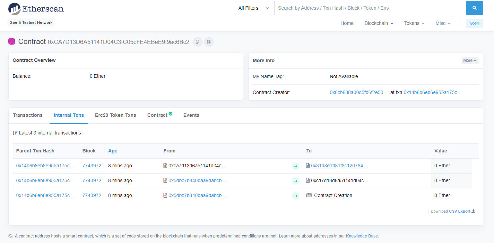
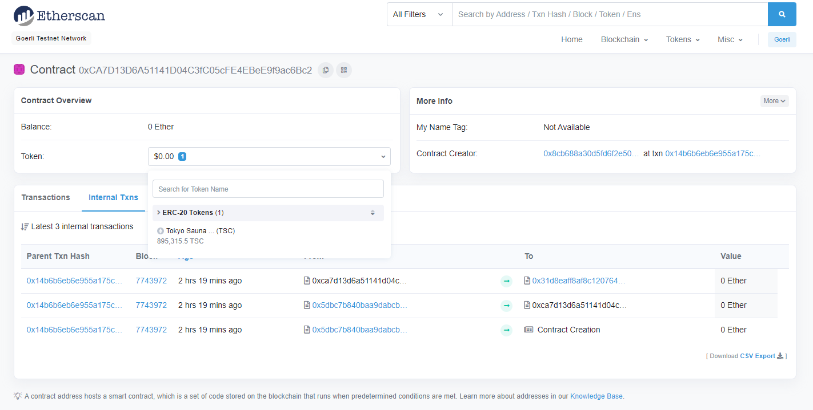

### 📝 ガバナンスコントラクトをデプロイする

DAOの運営のために使われるガバナンストークンは素晴らしいものですが、それを使って運営できなければ意味がありません。

次に行うのは、ガバナンストークンを用いて提案・投票できるコントラクトを作成することです。

ここで作成するコントラクトは、DAOメンバーによる提案に対して投票を行い、その票を自動的に集計します。

すべてのDAOメンバーがこれらをすべてオンチェーンで実行できるようにします。

例えば、「ランディングページのデザインを作成してもらうために、Aさんに1000トークンを譲渡する」というような提案を作成するとします。

- 投票は誰ができるのでしょうか？
- 投票に必要な時間はどれくらいなのでしょうか？
- 提案するために必要なトークンの最低数はどれくらいでしょうか？

これらの疑問はすべて、最初に作成するガバナンスコントラクトで解決されます。

まるで小さな国を立ち上げるようなもので、最初の政府と投票システムを設定する必要があるのです。

ただし、ガバナンスはあまり複雑にしないほうが一般的には良いとされています。

それでは早速、`src/scripts/8-deploy-vote.ts`を作成し、以下のコードを追加しましょう。

```typescript
import sdk from './1-initialize-sdk';
import { ERCTokenAddress } from './module';

(async () => {
  try {
    const voteContractAddress = await sdk.deployer.deployVote({
      // ガバナンス用のコントラクトに名前を付けます
      name: 'My amazing DAO',

      // ERC-20 トークンのコントラクトアドレスを設定します
      voting_token_address: ERCTokenAddress,

      // 以下の 2 つのパラメータはブロックチェーンのブロック数を指定します（Ethereum の場合、ブロックタイムを 13-14 秒と仮定）
      // 提案が作成された後、メンバーがすぐに投票できるよう 0 ブロックを設定する
      voting_delay_in_blocks: 0,

      // 提案が作成された後、メンバーが投票できる期間を 1 日（6570 ブロック）に設定する
      voting_period_in_blocks: 6570,

      // 提案の投票期間が終了した後、提案が有効となるために投票する必要があるトークンの総供給数の最小値を 0% に設定する
      voting_quorum_fraction: 0,

      // ユーザーが提案するために必要なトークンの最小値を 0 に設定する
      proposal_token_threshold: 0,
    });

    console.log(
      '✅ Successfully deployed vote contract, address:',
      voteContractAddress,
    );
  } catch (err) {
    console.error('Failed to deploy vote contract', err);
  }
})();
```

コントラクトをセットアップするために`deployer.deployVote`を使用しています。

これは全く新しい投票用コントラクトをデプロイします。

`voting_token_address`を設定していることに注目してください。

ここでは、どのトークンをガバナンストークンとして設定するかをコントラクトに示しています。

`voting_delay_in_blocks`では、メンバーが投票できるようになるまでの期間を設定しています。

メンバーが投票できるようになる前に、提案について検討する時間を与えたい場合に便利です。

同様に、`voting_period_in_blocks`もあります。

これは、提案が有効になってから投票できる期間をブロック単位で指定しています。

`voting_quorum_fraction`では、「ある提案を通すためには、最低x ％ のトークンが投票に使われなければならない定数」を設定しています。

例えば、あるメンバーが提案を作成し、他のすべてのメンバーがディズニーランドで休暇中のためオンラインになっていないとします。

そんな状況で、提案を作成したメンバーが自分で作成した提案に「賛成」と投票すると、投票の100％ が「賛成」となり、`voting_period_in_blocks`で設定した期間が終了するとその提案が可決されてしまいます。

`voting_quorum_fraction`はこれを避けるために設定されるのです。

最後に、`proposal_token_threshold`です。

今回のように、設定値が`0`であれば、ガバナンストークンを持っていなくても、誰でも提案を作成することができます。

これをどう設定するかはあなた次第です。

今回はとりあえず`0`のままにしておきましょう。

それでは、ターミナルに移動し、下記コマンドを実行してみましょう。

```
yarn node --loader ts-node/esm src/scripts/8-deploy-vote.ts
```

以下のような表示がされたら、成功です。

```
SDK initialized by address: 0x8cB688A30D5Fd6f2e5025d8915eD95e770832933
✅ Successfully deployed vote contract, address: 0xCA7D13D6A51141D04C3fC05cFE4EBeE9f9ac6Bc2
Done in 50.84s.
```

オンチェーンでの提案に対し投票できるようにする標準的なガバナンスコントラクトをデプロイできました。

デプロイしたコントラクトは、[こちら](https://sepolia.etherscan.io/)から確認することができます。



ここまでで、NFT・トークン・投票の3つのコントラクトが完成しました。

※ 今回作成したガバナンスコントラクトのアドレスは保存しておいてください。


### 🏦 トレジャリーをセットアップする

ガバナンスコントラクトのデプロイが終わり、投票ができるようになりましたね。

しかし、ガバナンスコントラクトにはトークンを移動させる機能がありません。

現状では、あなたのウォレットがガバナンストークンの供給に関する全権限（トークンの移動、エアドロップなど）を持っています。

これでは、あなたが独裁者のようにDAOを自由に操作できてしまいます。

権限を分散化させるためにも、これから全トークンの90％ をガバナンスコントラクトに移動させましょう。

これにより、あなたではなく、ガバナンスコントラクトがトークンを供給できるようになります。

これが、本質的に **DAO の金庫（トレジャリー）** となるのです。

今回は90％ という数字をランダムに選びました。

参考までに、ENSのトークンの配布割合は以下のとおりとなっています。


ENSでは、供給量の50％ がコミュニティ、25％ はエアドロップ、残りの25％ はコアチームと貢献者に割り当てています。

ちなみに、DAOのトークノミクスはDAOごとに異なっており、現時点でベストプラクティスとされるものまだ定義されていません。

それでは、`src/scripts/9-setup-vote.ts`を作成し、以下のコードを追加しましょう。

```typescript
import sdk from './1-initialize-sdk';
import { ERCTokenAddress, governanceAddress } from './module';

// ガバナンスコントラクトのアドレスを設定します
const vote = sdk.getContract(governanceAddress, 'vote');

// ERC-20 コントラクトのアドレスを設定します。
const token = sdk.getContract(ERCTokenAddress, 'token');

(async () => {
  try {
    // 必要に応じて追加のトークンを作成する権限をトレジャリーに与えます
    await (await token).roles.grant('minter', (await vote).getAddress());

    console.log(
      'Successfully gave vote contract permissions to act on token contract',
    );
  } catch (error) {
    console.error(
      'failed to grant vote contract permissions on token contract',
      error,
    );
  }

  try {
    // ウォレットのトークン残高を取得します
    const ownedTokenBalance = await (
      await token
    ).balanceOf(process.env.WALLET_ADDRESS!);

    // 保有する供給量の 90% を取得します
    const ownedAmount = ownedTokenBalance.displayValue;
    const percent90 = (Number(ownedAmount) / 100) * 90;

    // 供給量の 90% をガバナンスコントラクトへ移動します
    await (await token).transfer((await vote).getAddress(), percent90);

    console.log(
      '✅ Successfully transferred ' + percent90 + ' tokens to vote contract',
    );
  } catch (err) {
    console.error('failed to transfer tokens to vote contract', err);
  }
})();
```

これはかなりシンプルなスクリプトです。

以下の2つのことをしています。

1. `(await token).balanceOf`を用いてウォレットにあるトークンの総数を取得しています。

   あなたのウォレットには、エアドロップしたトークンを除いて、すべてのガバナンストークンがあることを思い出してください。

2. あなたが所有しているガバナンストークンの総供給量を取得し、その90％ を`(await token).transfer`を使ってガバナンスコントラクトに送信します。

   すべてのトークンを転送することもできますが、トークンの一部は制作者である自分のために残しておきたいかもしれませんね！

それでは、ターミナルに移動し、下記コマンドを実行してみましょう。

```
yarn node --loader ts-node/esm src/scripts/9-setup-vote.ts
```

以下のような表示がされたら、成功です。

```
SDK initialized by address: 0x8cB688A30D5Fd6f2e5025d8915eD95e770832933
Successfully gave vote contract permissions to act on token contract
✅ Successfully transferred 895315.5000000001 tokens to vote contract
Done in 41.00s.
```

さて、ここまでできたら[こちら](https://sepolia.etherscan.io/)からガバナンスコントラクトを覗いてみましょう。

`Token: `の横にあるドロップダウン(`$0.00 1️⃣`)をクリックしてみてください。

ここで、私のコントラクトには`895,315.5 TSC`と表示されているのがわかると思います。



これで無事DAOのトレジャリーの用意ができました。


### 🙋‍♂️ 質問する

ここまでの作業で何かわからないことがある場合は、Discordの`#ethereum`で質問をしてください。

ヘルプをするときのフローが円滑になるので、エラーレポートには下記の4点を記載してください ✨

```
1. 質問が関連しているセクション番号とレッスン番号
2. 何をしようとしていたか
3. エラー文をコピー&ペースト
4. エラー画面のスクリーンショット
```

---

次のレッスンでは、プロポーザルでの投票機能をつくっていきます！
