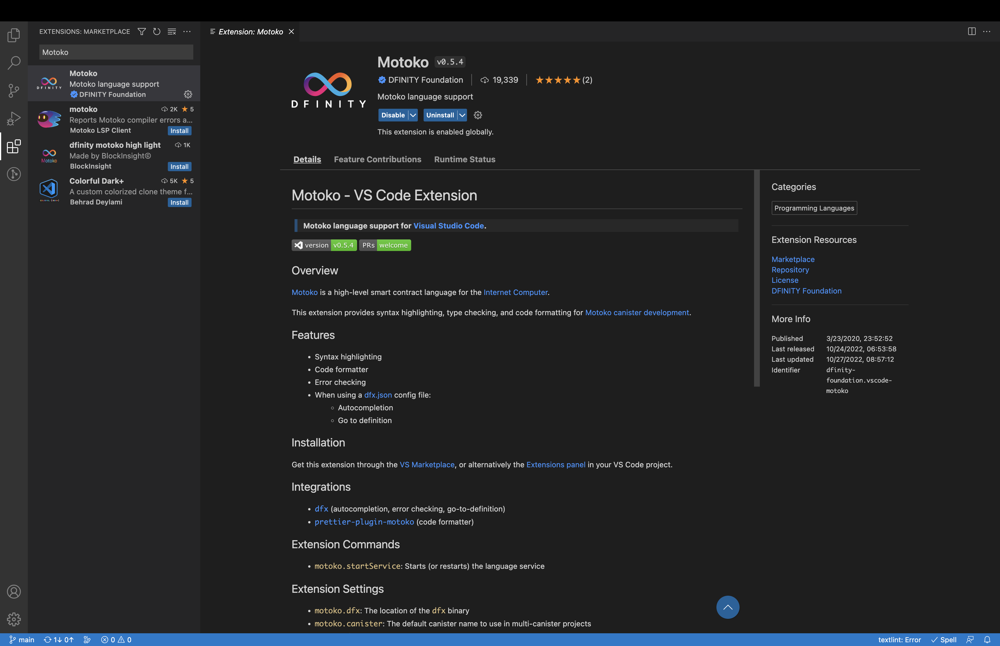
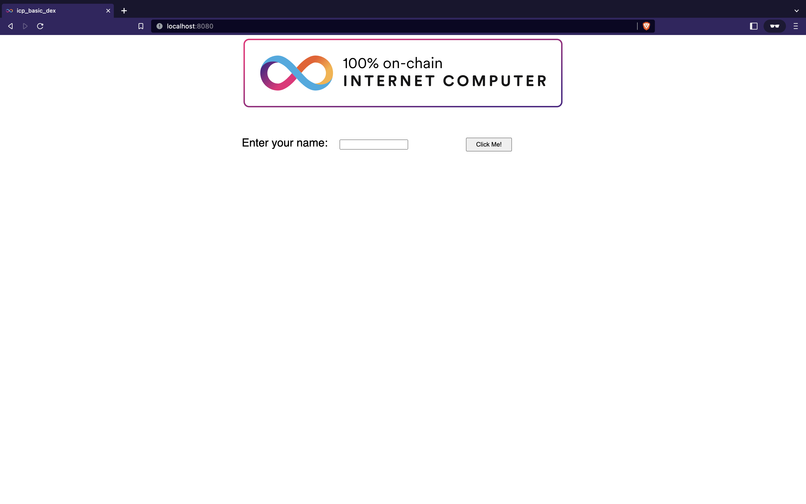

### 🔥 サイクル取得の申請をしよう

[ICP-Static-Site サイクル取得の申請をしよう](https://app.unchain.tech/learn/ICP-Static-Site/section-1_lesson-1)を参照して、無料でサイクルを取得するためのコードを受け取りましょう。

※ 実際にサイクルを使用するのは、本コンテンツのセクション4になります。申請後は、返答を待つ間次に進んでいただいて大丈夫です！

### 🦄 IC SDK をインストールする

IC SDKとはDFINITYが提供する、ICPブロックチェーン上でキャニスター・スマートコントラクトを作成・管理するために使用されるソフトウェア開発キットです。

[公式ドキュメント](https://internetcomputer.org/docs/current/developer-docs/setup/install/)を参考に、インストールをしていきましょう。

今回は、バージョン`0.14.1`を指定してインストールをしたいと思います。ターミナルで以下のコマンドを実行しましょう。

```
DFX_VERSION=0.14.1 sh -ci "$(curl -sSL https://internetcomputer.org/install.sh)"
```

正しくインストールされたことを確認するために、以下を実行します。

```
dfx --version
```

バージョン`0.14.1`が表示されたら完了です。

```
dfx 0.14.1
```

### 🛠 VS Code の拡張機能をインストールする

このプロジェクトでは、開発に`Motoko`を使用します。

Motokoは、DFINITY財団が開発中の新しいソフトウェア言語で、インターネット・コンピュータ・ブロックチェーン上で信頼性と保守性の高いウェブサイト、企業システム、インターネットシステムを、できるだけ幅広い層の開発者が簡単に作成できるように設計されています。今回はこのプログラミング言語を使用して、バックエンドを構築してきます！

コーディングのサポートツールとして、以下の拡張機能のインストールをお勧めします。

**Motoko**



### ✨ Node.js の確認をする

`node` / `npm`がインストールされている必要があります。お持ちでない場合は、[こちら](https://hardhat.org/tutorial/setting-up-the-environment.html)にアクセスし、インストールをしてください（Hardhatのためのサイトですが気にしないでください）。

`node v16`をインストールすることを推奨しています。

### 🗂 新規プロジェクトを作成しよう

それでは、先ほどインストールをした`dfx`を使用して新しいプロジェクトを作成していきましょう。

プロジェクトを構築する任意のフォルダに移動後、以下のコマンドを実行します。このプロジェクトでは、`icp_basic_dex`という名前で作成します。

```
dfx new icp_basic_dex
```

`dfx new`コマンドは、プロジェクトディレクトリ、テンプレートファイル、および新しいGitリポジトリを作成します。
プロジェクトが作成されると、このように出力されます。


作成されたプロジェクトが以下のような構成になっていることを確認してください。

```
icp_basic_dex/
├── .env
├── .git/
├── .gitignore
├── README.md
├── dfx.json
├── node_modules/
├── package-lock.json
├── package.json
├── src/
└── webpack.config.js
```

それでは、サンプルプロジェクトを実行してみましょう。まずはプロジェクトのルートディレクトリへ移動します。

```
cd icp_basic_dex
```

プロジェクトをローカル環境へデプロイする前に、ローカルのキャニスター実行環境を起動する必要があります。以下のコマンドを実行して、キャニスター実行環境を立ち上げましょう。`--clean`オプションは、ローカルのキャッシュを削除してクリーンな状態で環境を立ち上げてくれます。`--background`オプションは、バックグラウンドで実行してくれるものです。

```
dfx start --clean --background
```

ターミナル上に出力された最後の行に、`Dashboard: http://localhost:58635/_/dashboard`と表示があれば起動成功です。

```
Running dfx start for version 0.14.1
Using the default definition for the 'local' shared network because /任意のパス/.config/dfx/networks.json does not exist.
Dashboard: http://localhost:58635/_/dashboard
```

⚠︎ `node_modules/`が存在しない場合は、デプロイ前にインストールを行なってください。

```
npm install
```

最後に、プロジェクトをデプロイします。`dfx deploy`というコマンドは、実行環境へキャニスターを登録・ビルド・デプロイが一括で行えるコマンドになります。なお、`deploy`コマンドは、キャニスターの設定が書かれたdfx.jsonファイルが存在する階層で実行しないとエラーになります。デプロイするキャニスターの情報を読み込めないためです。

```
dfx deploy
```

ターミナルには、実行された操作に関する情報が表示されます。たとえば、今回のサンプルプロジェクトでは2つのキャニスター（icp_basic_dex_backendとicp_basic_dex_frontend）がデプロイされます。

```
$ dfx deploy

dfx deploy
Creating a wallet canister on the local network.
The wallet canister on the "local" network for user "default" is "rwlgt-iiaaa-aaaaa-aaaaa-cai"
Deploying all canisters.
Creating canisters...
Creating canister icp_basic_dex_backend...
icp_basic_dex_backend canister created with canister id: rrkah-fqaaa-aaaaa-aaaaq-cai
Creating canister icp_basic_dex_frontend...
icp_basic_dex_frontend canister created with canister id: ryjl3-tyaaa-aaaaa-aaaba-cai
Building canisters...
Building frontend...
Installing canisters...
Creating UI canister on the local network.
The UI canister on the "local" network is "r7inp-6aaaa-aaaaa-aaabq-cai"
Installing code for canister icp_basic_dex_backend, with canister ID rrkah-fqaaa-aaaaa-aaaaq-cai
Installing code for canister icp_basic_dex_frontend, with canister ID ryjl3-tyaaa-aaaaa-aaaba-cai
Uploading assets to asset canister...
Starting batch.
Staging contents of new and changed assets:
  /main.css (gzip) 1/1 (297 bytes)
  /index.html 1/1 (698 bytes)
  /index.html (gzip) 1/1 (395 bytes)
  /main.css 1/1 (537 bytes)
  /logo2.svg 1/1 (15139 bytes)
  /index.js 1/1 (637293 bytes)
  /index.js (gzip) 1/1 (152860 bytes)
  /sample-asset.txt 1/1 (24 bytes)
  /index.js.map 1/1 (682174 bytes)
  /index.js.map (gzip) 1/1 (156928 bytes)
  /favicon.ico 1/1 (15406 bytes)
Committing batch.
Deployed canisters.
URLs:
  Frontend canister via browser
    icp_basic_dex_frontend: http://127.0.0.1:4943/?canisterId=ryjl3-tyaaa-aaaaa-aaaba-cai
  Backend canister via Candid interface:
    icp_basic_dex_backend: http://127.0.0.1:4943/?canisterId=r7inp-6aaaa-aaaaa-aaabq-cai&id=rrkah-fqaaa-aaaaa-aaaaq-cai
```

フロントエンドをテストしてみましょう。

以下のコマンドを実行し、開発サーバーを起動します。

```
npm start
```

ブラウザからアクセスできることを確認してみます。ターミナル上に出力されたURLにアクセスしてみましょう。以下のようなサンプルプロジェクトのUIが表示されます。



これで、準備は完了です！ バックグラウンドで実行されているキャニスター実行環境を、一度止めておきましょう。最初にwebpackが起動しているターミナル上で`Control + C`を押すなどして、サーバーを停止します。

```
webpack 5.75.0 compiled successfully in 485 ms
# Control+Cで停止
^C
```

サーバーが停止してターミナルが入力できるようになったら、以下のコマンドを実行してキャニスター実行環境を停止しましょう。

```
dfx stop
```

### 🙋‍♂️ 質問する

ここまでの作業で何かわからないことがある場合は、Discordの`#icp`で質問をしてください。

ヘルプをするときのフローが円滑になるので、エラーレポートには下記の4点を記載してください ✨

```
1. 質問が関連しているセクション番号とレッスン番号
2. 何をしようとしていたか
3. エラー文をコピー&ペースト
4. エラー画面のスクリーンショット
```

---

次のレッスンに進んで、バックエンドの構築をしていきましょう 🎉
