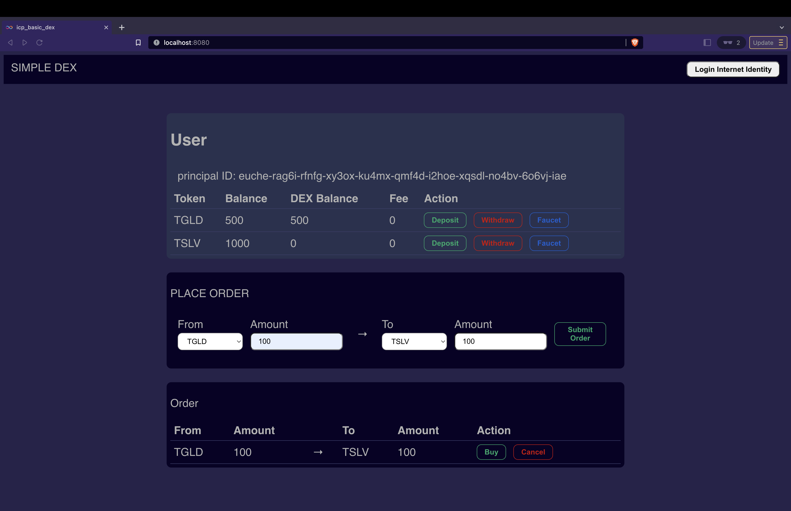
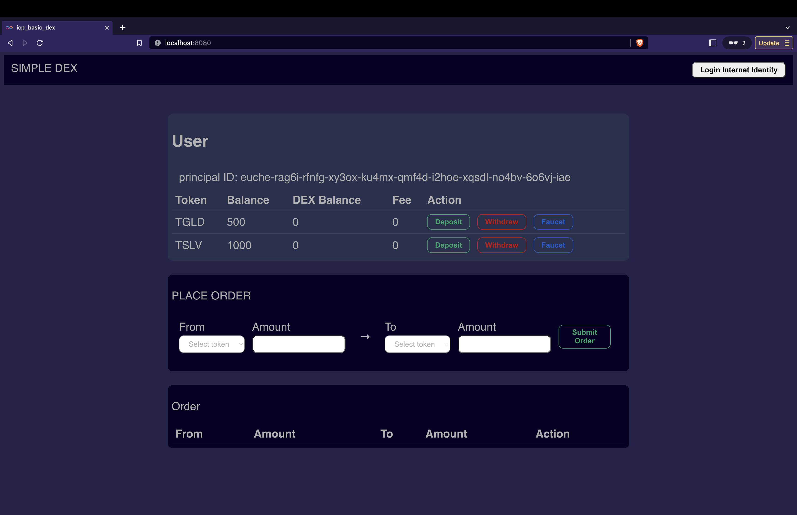

### 🎓 データを永続的に保存する方法を知ろう

ICの重要な特徴の1つに、従来のデータベースを使わずにキャニスターの状態を永続化できる点があります。永続化には、**ステーブル**（Stable）と呼ばれるメモリ領域が用いられます。通常のキャニスター・メモリとは異なり、ステーブルに保存されたデータはアップグレード（データを保持するバックエンドキャニスターの再デプロイなど）を超えて保持されるという特徴があります。データを損失することなくアップグレードに対応するには、ステーブルに保存したいデータをプログラマが自身で定義する必要があります。

**`stable`キーワード**

変数の宣言に`stable`キーワードを使用することで、その変数をステーブルなメモリ領域に保存することを指示できます。

**`preupgrade`と`postupgrade`**

実は、全ての型の変数が`stable`キーワードで解決できる訳ではありません。例えば`HashMap`が挙げられます。ステーブル変数だけでは解決できない場合のために、Motokoはユーザー定義のアップグレードフックをサポートしています。このフックは、アップグレードの前後に実行されるもので`preupgrade`と`postupgrade`という特別な名前を持つ`system`関数として宣言されます。アップグレード前に、ステーブルを定義できない変数からステーブル変数へデータを保存し、アップグレード後に元の型へ戻すというフックを定義するという使い方をします。

ここで、永続化を行なっていない現在のDEXでは何が起こるかを確認しておきたいと思います。DEX内にトークンを入金している、かつオーダーを作成している状態を作ります（確認ができれば良いので、以下の画像と全く同じ状況を作り出す必要はありません）。



このようにDEX内にデータが格納されている状態で、`main.mo`を更新してみたいと思います。`main.mo`ファイルに定義した`last_id`変数の初期値を修正して再デプロイを行います。

```javascript
private var last_id : Nat32 = 100; // TODO: 後で初期値0に戻す
```

```
dfx deploy icp_basic_dex_backend
```

ブラウザをリロードしてみると、DEXに預けたトークンとオーダーの情報が取得できていない（リセットされた）ことが確認できます。ただし、預けていないトークンの情報は保持されています。これは、DIP20が永続化を行なっているためです。コードを覗いてみるとわかりますが、`stable`変数が定義されています。



それでは、大切なデータが失われないように永続化を行うためのコードを追加していきましょう。

### 🔐 Faucet キャニスターのデータを永続化しよう

`faucet`ディレクトリ内のファイルを編集していきます。

まずは、`stable`キーワードをつけた`faucetBookEntries`変数を定義します。以下のように、stable変数を`main.mo`ファイルに追加しましょう。

[faucet/main.mo]

```diff
shared (msg) actor class Faucet() = this {
  private type Token = Principal;

  private let FAUCET_AMOUNT : Nat = 1_000;

+  // アップグレード時にトークンを配布したユーザーを保存しておく`stable`変数
+  private stable var faucetBookEntries : [var (Principal, [Token])] = [var];
```

続いて、アップグレードフック(`preupgrade`と`postupgrade`)を定義します。以下のように`checkDistribution`関数の下に追加すると良いでしょう。

[faucet/main.mo]

```diff
  // Faucetとしてトークンを配布しているかどうかを確認する
  // 配布可能なら`#Ok`、不可能なら`#Err`を返す
  private func checkDistribution(user : Principal, token : Token) : async T.FaucetReceipt {
  };

+  // ===== UPGRADE =====
+  system func preupgrade() {
+    // `faucet_book`に保存されているデータのサイズでArrayの初期化をする
+    faucetBookEntries := Array.init(faucet_book.size(), (Principal.fromText("aaaaa-aa"), []));
+    var i = 0;
+    for ((x, y) in faucet_book.entries()) {
+      faucetBookEntries[i] := (x, y);
+      i += 1;
+    };
+  };
+
+  system func postupgrade() {
+    // Arrayに保存したデータを`HashMap`に再構築する
+    for ((key : Principal, value : [Token]) in faucetBookEntries.vals()) {
+      faucet_book.put(key, value);
+    };
+
+    // `Stable`に使用したメモリをクリアする
+    faucetBookEntries := [var];
+  };
};
```

### 🔐 　 DEX キャニスターのデータを永続化しよう

`icp_basic_dex_backend`ディレクトリ内のファイルを編集していきます。まずは、`stable`変数を定義しましょう。

[icp_basic_dex_backend/main.mo]

```diff
actor class Dex() = this {

+  // アップグレード時にオーダーを保存しておく`Stable`変数
+  private stable var ordersEntries : [T.Order] = [];

+  // DEXに預けたユーザーのトークン残高を保存する`Stable`変数
+  private stable var balanceBookEntries : [var (Principal, [(T.Token, Nat)])] = [var];

  // DEXのユーザートークンを管理するモジュール
  private var balance_book = BalanceBook.BalanceBook();

  // オーダーのIDを管理する`Stable`変数
-  private var last_id : Nat32 = 100; // TODO: 後で初期値0に戻す
+  private stable var last_id : Nat32 = 100; // TODO: 後で初期値0に戻す

  // オーダーを管理するモジュール
  private var exchange = Exchange.Exchange(balance_book);
```

続いて、アップグレードフックを定義します。以下のように、`getBalance`関数の下に追加すると良いでしょう。

[icp_basic_dex_backend/main.mo]

```diff
  // ===== DEX STATE FUNCTIONS =====
  // 引数で渡されたトークンPrincipalの残高を取得する
  public query func getBalance(user : Principal, token : T.Token) : async Nat {
  };

+  // ===== UPGRADE =====
+  system func preupgrade() {
+    // DEXに預けられたトークンデータを`Array`に保存
+    balanceBookEntries := Array.init(balance_book.size(), (Principal.fromText("aaaaa-aa"), []));
+    var i = 0;
+    for ((x, y) in balance_book.entries()) {
+      balanceBookEntries[i] := (x, Iter.toArray(y.entries()));
+      i += 1;
+    };
+
+    // book内で管理しているオーダーを保存
+    ordersEntries := exchange.getOrders();
+  };
+
+  // キャニスターのアップグレード後、`Array`から`HashMap`に再構築する。
+  system func postupgrade() {
+    // `balance_book`を再構築
+    for ((key : Principal, value : [(T.Token, Nat)]) in balanceBookEntries.vals()) {
+      let tmp : HashMap.HashMap<T.Token, Nat> = HashMap.fromIter<T.Token, Nat>(Iter.fromArray<(T.Token, Nat)>(value), 10, Principal.equal, Principal.hash);
+      balance_book.put(key, tmp);
+    };
+
+    // オーダーを再構築
+    for (order in ordersEntries.vals()) {
+      exchange.addOrder(order);
+    };
+
+    // `Stable`に使用したメモリをクリアする.
+    balanceBookEntries := [var];
+    ordersEntries := [];
+  };
};
```

最後に、`main.mo`のアップグレードフックで呼び出している`BalanceBook`モジュールの関数を、以下のように3つ追加します。

[balance_book.mo]

```diff
module {
  public class BalanceBook() {

    // ユーザーとトークンの種類・量をマッピング
    var balance_book = HashMap.HashMap<Principal, HashMap.HashMap<T.Token, Nat>>(10, Principal.equal, Principal.hash);

+    // ユーザーと預け入れたトークンデータを追加する
+    // `postupgrade`を実行する際に使用される
+    public func put(user : Principal, userBalances : HashMap.HashMap<T.Token, Nat>) {
+      balance_book.put(user, userBalances);
+    };
+
+    // ユーザーPrincipalとトークンデータのイテレータを返す
+    // `postupgrade`を実行する際に使用される
+    public func entries() : Iter.Iter<(Principal, HashMap.HashMap<T.Token, Nat>)> {
+      balance_book.entries();
+    };
+
+    // 保存されているデータの量を返す
+    // `postupgrade`を実行する際に使用される
+    public func size() : Nat {
+      balance_book.size();
+    };

    // ユーザーPrincipalに紐づいたトークンと残高を取得
    public func get(user : Principal) : ?HashMap.HashMap<T.Token, Nat> {
      return balance_book.get(user);
    };
```

準備ができたので、実際に永続化が行われるのかを確認しましょう。編集した2つのキャニスターを再度デプロイします。

```
dfx deploy faucet && dfx deploy icp_basic_dex_backend
```

改めて、DEX内にトークンを入金している、かつオーダーを作成している状態を作ります。


この状態のまま、icp_basic_dex_backendのコードを編集して再デプロイを行います。`main.mo`ファイルに定義した`last_id`変数の初期値を`0`に戻しましょう。

```javascript
private stable var last_id : Nat32 = 0;
```

```
dfx deploy icp_basic_dex_backend
```

画面をリロードしてみましょう。DEXに預けたトークンの情報とオーダーが再取得できている（保持されている）ことが確認できたら完了です。これで、キャニスターのアップグレード後も大切なデータが失われないようにすることができました！

### 🙋‍♂️ 質問する

ここまでの作業で何かわからないことがある場合は、Discordの`#icp`で質問をしてください。

ヘルプをするときのフローが円滑になるので、エラーレポートには下記の4点を記載してください ✨

```
1. 質問が関連しているセクション番号とレッスン番号
2. 何をしようとしていたか
3. エラー文をコピー&ペースト
4. エラー画面のスクリーンショット
```

---

次のレッスンに進んで、完成したアプリケーションをメインネットにデプロイしましょう！
