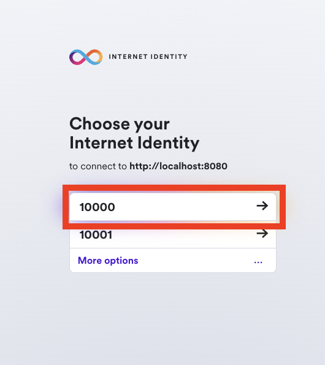
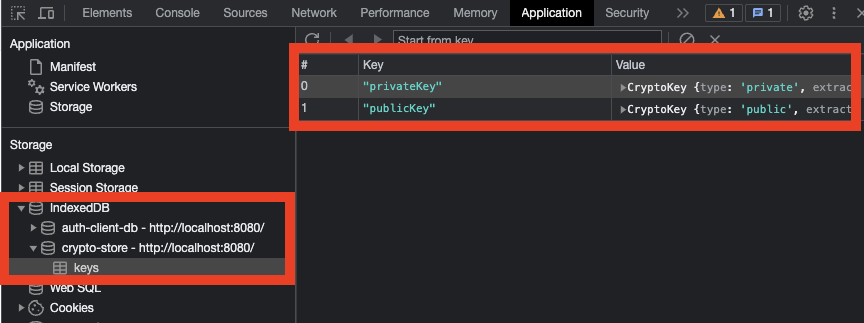

### 🛢 データベースを作成しよう

まずは、公開鍵と秘密鍵を保存するデータベースから作成していきましょう。

ブラウザ上のローカルストレージは、string型のデータしか保存できません。しかし、このレッスンで生成する鍵は[`CryptoKey`](https://developer.mozilla.org/ja/docs/Web/API/CryptoKey)オブジェクトです。管理を簡単にするため、CryptoKeyオブジェクトをそのまま保存できる[idb](https://github.com/jakearchibald/idb#readme)というデータベースを用意したいと思います。

まずは、パッケージをインストールしましょう。

```
npm install idb
```

次に、データベースを操作するための関数を定義します。`lib/`内に`keyStorage.ts`を作成しましょう。

```diff
encrypted_notes_frontend/
└── src/
    ├── components/
    ├── hooks/
    ├── lib/
        ├── cryptoService.ts
+       └── keyStorage.ts
```

作成したkeyStorage.tsに下記のコードを記述しましょう。ここで実装する機能は、データベースの作成、データの保存、データの取得、データの削除の4つです。

```ts
import { DBSchema, openDB } from 'idb'

// データベースの型を定義します。
interface KeyStorage extends DBSchema {
  'keys': {
    key: string;
    value: CryptoKey;
  };
}

// データベースを開きます
const db = openDB<KeyStorage>('crypto-store', 1, {
  upgrade(db) {
    db.createObjectStore('keys');
  },
});

// 'keys'ストアに値を保存します
export async function storeKey(key: string, value: CryptoKey) {
  return (await db).put('keys', value, key)
}

// 値を'keys'ストアから取得します
export async function loadKey(key: string) {
  return (await db).get('keys', key)
}

// 'keys'ストアから値を削除します
export async function clearKeys() {
  return (await db).clear('keys')
}

```

### 🔑 公開鍵・秘密鍵を生成しよう

データベースの準備ができたので、次にキーペアを生成する機能を実装しましょう。`lib/cryptoService.ts`を更新していきます。

先ほど作成した`keyStorage.ts`をインポートします。

```ts
import { clearKeys, loadKey, storeKey } from './keyStorage';
```

鍵の生成（または取得）を行う`init`関数を更新します。下記を参考に、`/** STEP6: 公開鍵・秘密鍵を生成します。 */`の部分にコードを追加しましょう。

```ts
  public async init(): Promise<boolean> {
    /** STEP6: 公開鍵・秘密鍵を生成します。 */
    // データベースから公開鍵・秘密鍵を取得します。
    this.publicKey = await loadKey('publicKey');
    this.privateKey = await loadKey('privateKey');

    if (!this.publicKey || !this.privateKey) {
      // 公開鍵・秘密鍵が存在しない場合は、生成します。
      const keyPair: CryptoKeyPair = await this.generateKeyPair();

      // 生成した鍵をデータベースに保存します。
      await storeKey('publicKey', keyPair.publicKey);
      await storeKey('privateKey', keyPair.privateKey);

      this.publicKey = keyPair.publicKey;
      this.privateKey = keyPair.privateKey;
    }

    /** STEP8: デバイスデータを登録します。 */

    /** STEP9: 対称鍵を生成します。 */

    return true;
  }
```

コードを確認しましょう。

最初に、`loadKey`関数を使用してデータベースから公開鍵・秘密鍵を取得します。

```ts
    this.publicKey = await loadKey('publicKey');
    this.privateKey = await loadKey('privateKey');
```

データベースに鍵が存在しない場合は、`generateKeyPair`関数を呼び出して鍵を生成します。

```ts
    if (!this.publicKey || !this.privateKey) {
      // 公開鍵・秘密鍵が存在しない場合は、生成します。
      const keyPair: CryptoKeyPair = await this.generateKeyPair();
```

generateKeyPair関数は、private関数としてあらかじめクラス内に定義されています。

```ts
  private async generateKeyPair(): Promise<CryptoKeyPair> {
    const keyPair = await window.crypto.subtle.generateKey(
      {
        name: 'RSA-OAEP',
        // キー長
        modulusLength: 4096,
        // 公開指数（65537 == 0x010001）
        publicExponent: new Uint8Array([0x01, 0x00, 0x01]),
        // ハッシュアルゴリズム
        hash: 'SHA-256',
      },
      true,
      ['encrypt', 'decrypt', 'wrapKey', 'unwrapKey'],
    );
    return keyPair;
  }
```

この関数は、`window.crypto.subtle.generateKey`を使用して、公開鍵・秘密鍵のペアを生成します。[crypto.subtle](https://developer.mozilla.org/ja/docs/Web/API/Crypto/subtle)は暗号に関する様々なメソッドを提供する[SubtleCrypto](https://developer.mozilla.org/ja/docs/Web/API/SubtleCrypto)オブジェクトを返します。[`generateKey`](https://developer.mozilla.org/ja/docs/Web/API/SubtleCrypto/generateKey)メソッドは、引数に与えられた条件に一致する鍵を含むオブジェクトを返します。

```javascript
generateKey(algorithm, extractable, keyUsages);
```

引数は3つ受け取ります。
1. algorithm: 生成する鍵の種類を指定します。今回は公開鍵・秘密鍵の鍵ペアを生成するため、`RSA-OAEP`を指定します。`RSA-OAEP`は、RSA暗号を使用して鍵を生成するためのアルゴリズムです。

2. extractable: 鍵を取り出すことができるかどうかをbooleanで指定します。鍵を取り出すとは、CryptoKeyオブジェクトを別のフォーマットに変換することを指します。変換することにより、例えばRustで構築されたバックエンドキャニスターなど別の場所で鍵を扱うことができます。

3. keyUsages: 鍵を使用する目的を配列で指定します。'encrypt'/'decrypt'は鍵をメッセージの暗号化・復号に使用し、'wrapKey'/'unwrapKey'は鍵をラップ・アンラップに使用することを示します。鍵のラップとは、鍵を他の鍵で暗号化することを指します。ラップすることにより、安全に転送・保存することができます。アンラップとは、ラップされた鍵を復号することを指します。

最終的に、generateKeyPair関数は、公開鍵・秘密鍵のペア（[CryptoKeyPair](https://developer.mozilla.org/ja/docs/Web/API/CryptoKeyPair)オブジェクト）を返します。CryptoKeyPairオブジェクトは、プロパティとしてpublicKeyとprivateKeyを持つので、`keyPair.publicKey`・`keyPair.privateKey`下記のようにして公開鍵・秘密鍵を取得することができます。生成した鍵はデータベースとクラスのメンバーに保存します。

```ts
      // 生成した鍵をデータベースに保存します。
      await storeKey('publicKey', keyPair.publicKey);
      await storeKey('privateKey', keyPair.privateKey);

      this.publicKey = keyPair.publicKey;
      this.privateKey = keyPair.privateKey;
```

最後にinit関数は`true`を返します。今はtrueを返すだけとなっていますがこのままにしておきます。以降のレッスンで更新していきます。

```ts
    return true;
```

それでは、init関数を呼び出してみましょう。`hooks/authContext.ts`内のある`/** STEP7: デバイスデータの設定を行います。 */`の部分に下記のコードを追加しましょう。

```ts
    /** STEP7: デバイスデータの設定を行います。 */
    const initialized = await cryptoService.init();
    console.log(`initialized: ${initialized}`);
```

### ✅ 動作確認をしよう

ブラウザに戻り、再度ログインボタンを押しましょう。前回のレッスンでIdentityの生成を済ませているので、そこから再デプロイを行なっていない限り、生成したidentityを選択して進みます。



開発環境下での動作確認なので、「Remind me later」を選択していただいて大丈夫です。


認証が完了したら、ストレージを見てみましょう。`crypto-store`というデータベースが作成され、中に公開鍵と秘密鍵が保存されていること確認しましょう。



### 📝 このレッスンで追加したコード

- `lib/keyStorage.ts`

レッスン最初の「🛢 データベースを作成しよう」を参照。

- `lib/cryptoService.ts`

```diff
+import { clearKeys, loadKey, storeKey } from './keyStorage';

...

  public async init(): Promise<boolean> {
    /** STEP6: 公開鍵・秘密鍵を生成します。 */
+    // データベースから公開鍵・秘密鍵を取得します。
+    this.publicKey = await loadKey('publicKey');
+    this.privateKey = await loadKey('privateKey');
+
+    if (!this.publicKey || !this.privateKey) {
+      // 公開鍵・秘密鍵が存在しない場合は、生成します。
+      const keyPair: CryptoKeyPair = await this.generateKeyPair();
+
+      // 生成した鍵をデータベースに保存します。
+      await storeKey('publicKey', keyPair.publicKey);
+      await storeKey('privateKey', keyPair.privateKey);
+
+      this.publicKey = keyPair.publicKey;
+      this.privateKey = keyPair.privateKey;
+    }

    /** STEP8: デバイスデータを登録します。 */

    /** STEP9: 対称鍵を生成します。 */

    return true;
  }

```

- `hooks/useContext.ts`

```diff
  const setupService = async (authClient: AuthClient) => {
    /** STEP2: 認証したユーザーのデータを取得します。 */
    const identity = authClient.getIdentity();

    /** STEP3: バックエンドキャニスターを呼び出す準備をします。 */
    // 取得した`identity`を使用して、ICと対話する`agent`を作成します。
    const newAgent = new HttpAgent({ identity });
    if (process.env.DFX_NETWORK === 'local') {
      newAgent.fetchRootKey();
    }
    // 認証したユーザーの情報で`actor`を作成します。
    const options = { agent: newAgent };
    const actor = createActor(canisterId, options);

    /** STEP5: CryptoServiceクラスのインスタンスを生成します。 */
    const cryptoService = new CryptoService(actor);
    /** STEP7: デバイスデータの設定を行います。 */
+    const initialized = await cryptoService.init();
+    console.log(`initialized: ${initialized}`);

    setAuth({ actor, authClient, cryptoService, status: 'SYNCED' });　　
  }
```

### 🙋‍♂️ 質問する

ここまでの作業で何かわからないことがある場合は、Discordの`#icp`で質問をしてください。

ヘルプをするときのフローが円滑になるので、エラーレポートには下記の4点を記載してください ✨

```
1. 質問が関連しているセクション番号とレッスン番号
2. 何をしようとしていたか
3. エラー文をコピー&ペースト
4. エラー画面のスクリーンショット
```

---

次のレッスンに進み、デバイスデータが登録できるようにしましょう！
