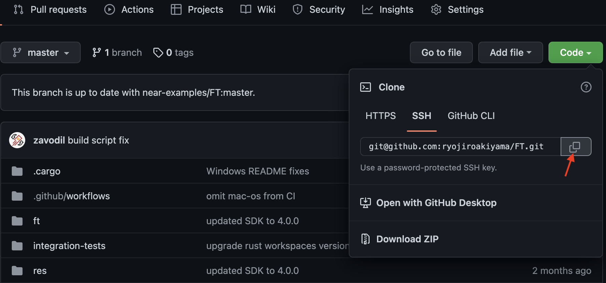

### ✨ スマートコントラクトのコードをクローンしよう

ft（fungible token）のスマートコントラクト(以降`ftコントラクト`)をデプロイしてオリジナルトークンを発行する準備をします！
今回は簡単にするため、`ftコントラクト`のコードはNEARコミュニティが用意している [example コード](https://github.com/near-examples)の中からコピーしてきてそのまま利用します。
（バイクを管理するコントラクトは次のセクションからスクラッチで書いていきます）。

まだGitHubのアカウントをお持ちでない方は、[こちら](https://qiita.com/okumurakengo/items/848f7177765cf25fcde0) の手順に沿ってアカウントを作成してください。

GitHubのアカウントをお持ちの方は、[こちら](https://github.com/near-examples/FT) から、ftリポジトリをあなたのGitHubにフォークしましょう。

フォークの方法は、[こちら](https://docs.github.com/ja/get-started/quickstart/fork-a-repo) を参照してください。

ご自身のGitHubアカウントにフォークしたftリポジトリをあなたのローカル環境にクローンしましょう。

下図のように、`Code`ボタンをクリックした後、`SSH`を選択し、Gitリンクをコピーしましょう。



> ✍️: SSH の設定を行う
>
> Github のレポジトリをクローンする際に、SSHKey を作成し、GitHub に公開鍵を登録する必要があります。
>
> SSH（Secure SHell）はネットワークを経由してマシンを遠隔操作する仕組みのことで、通信が暗号化されているのが特徴的です。
>
> 主にクライアント（ローカル）からサーバー（リモート）に接続をするときに使われます。この SSH の暗号化について、仕組みを見ていく上で重要になるのが秘密鍵と公開鍵です。
>
> まずはクライアントのマシンで秘密鍵と公開鍵を作り、公開鍵をサーバーに渡します。そしてサーバー側で「この公開鍵はこのユーザー」というように、紐付けを行っていきます。
>
> 自分で管理して必ず見せてはいけない秘密鍵と、サーバーに渡して見せても良い公開鍵の 2 つが SSH の通信では重要になってきます。
> Github における SSH の設定は、[こちら](https://docs.github.com/ja/authentication/connecting-to-github-with-ssh) を参照してください!

ターミナル作業したいディレクトリに移動し、先ほどコピーしたリンクを貼り付け、下記を実行してください。

```
git clone コピーした_github_リンク
```

クローンした`FT`ディレクトリに移動します。

リポジトリの中身は以下のようになっています。

- 階層は1階層分のみ表示しています。
- ディレクトリは末尾に`/`をつけて表示しています。

```
FT/
├── LICENSE
├── LICENSE-APACHE
├── README-Windows.md
├── README.md
├── ft/
├── integration-tests/
├── res/
├── rustfmt.toml
├── scripts/
└── test-contract-defi/
```

ここで重要なのは`ft`ディレクトリと`res`ディレクトリです。
`res`ディレクトリはWasm形式にコンパイルしたファイルを格納する場所です。
もし存在しない場合は作ってしまいましょう!(`mkdir res`で作成できます。)
`ft`ディレクトリ内は以下のような構成になっています。
※`ft/src/target`や`ft/src/Cargo.lock`がもし存在しない場合は問題ないのでそのまま進みましょう 🙆‍♂️

```
ft/
├── Cargo.lock
├── Cargo.toml
├── src/
│   └── lib.rs
└── target/
    ├── CACHEDIR.TAG
    ├── release/
    └── wasm32-unknown-unknown/
```

ftディレクトリはコントラクトに関わるものが入っています。
ここでは`ft/src/lib.rs`の中にコントラクトのコードが記述されていて,
`ft/src/Cargo.toml`の中にコードを管理する情報が記述されているということだけ覚えておきましょう。

### 🙋‍♂️ 質問する

ここまでの作業で何かわからないことがある場合は、Discordの`#near`で質問をしてください。

ヘルプをするときのフローが円滑になるので、エラーレポートには下記の4点を記載してください ✨

```
1. 質問が関連しているセクション番号とレッスン番号
2. 何をしようとしていたか
3. エラー文をコピー&ペースト
4. エラー画面のスクリーンショット
```

---

次のレッスンでは早速コントラクトをデプロイしてみます！
