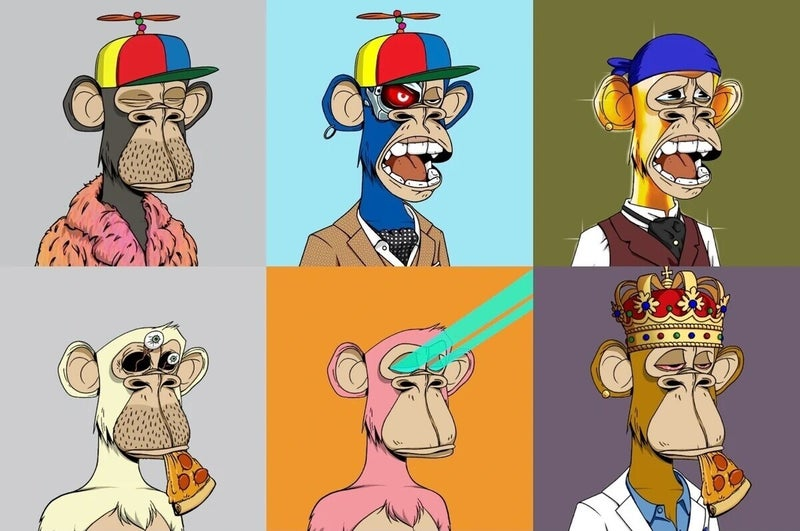
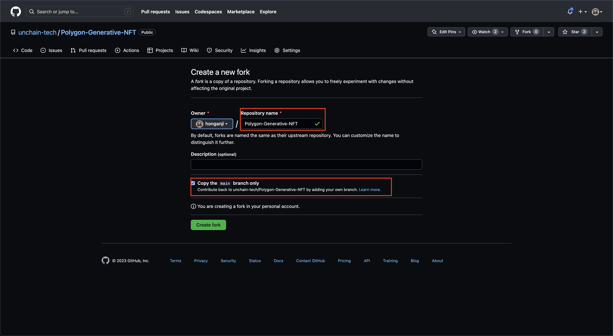
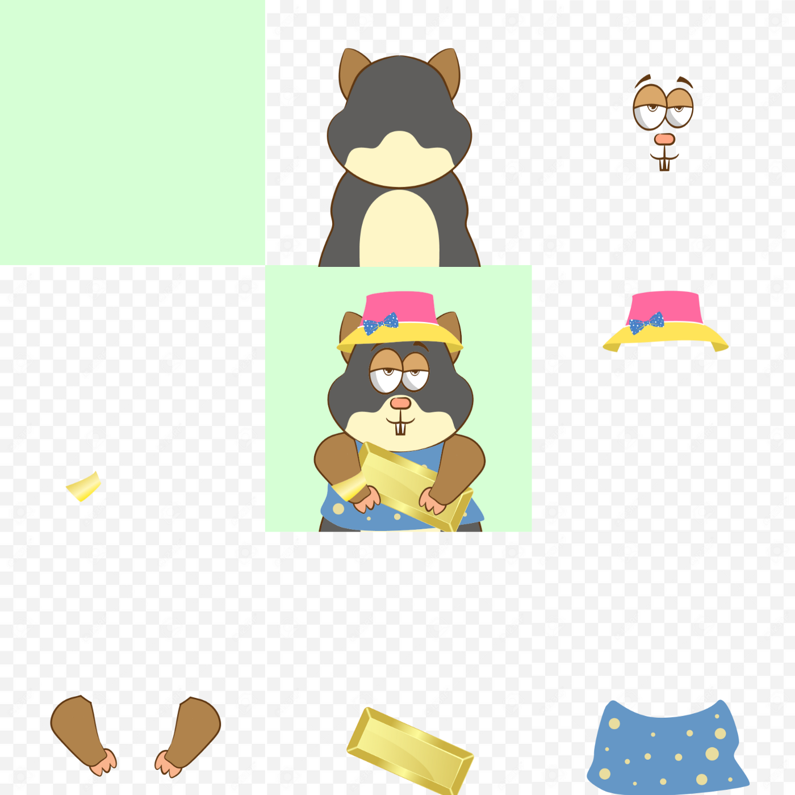
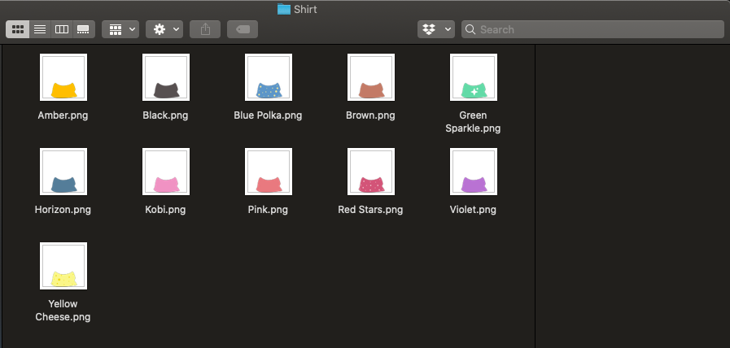
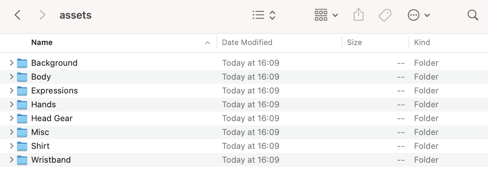
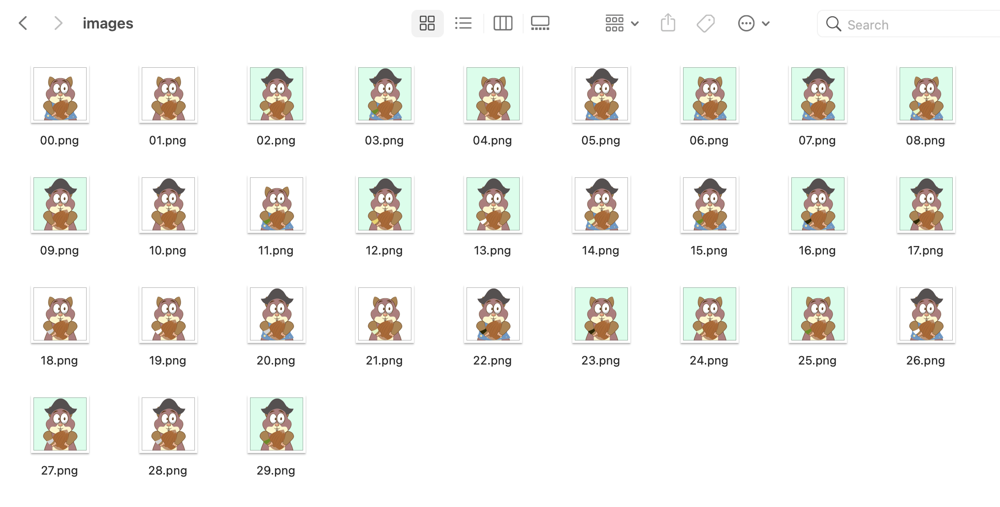

### 💠 希少性を備えたジェネレーティブ NFT アートを作成する

[Cryptopunks](https://www.larvalabs.com/cryptopunks)（クリプトパンクス）や [Bored Ape Yacht Club](https://boredapeyachtclub.com/#/)（BAYC：ボアードエイプ・ヨットクラブ）などのNFTプロジェクトを知っていますか？

これらのプロジェクトは、数億ドルの収益を生み出し、所有者の一部は億万長者となっています。

[Cryptopunks](https://www.larvalabs.com/cryptopunks)（クリプトパンクス）。


[Bored Ape Yacht Club](https://boredapeyachtclub.com/#/)（BAYC：ボアードエイプ・ヨットクラブ）。


これらは、数量が限られたアバターのコレクションです。

各アバターは一意（ユニーク）であり、一連の特徴（肌の色、髪型など）を持っています。

**さまざまな特徴を画像として作成した後、コードよってそれらを組み合わせ生成する NFT のことを Generative Art NFT と呼びます。**

今回のレッスンでは環境構築をした後、CryptopunksやBAYCのような希少性を備えたGenerative ArtのNFTコレクションを作成する方法を学びます。

✍️: NFTに関する詳しい説明は、[こちら](https://github.com/unchain-dev/UNCHAIN-projects/blob/main/docs/Polygon-Generative-NFT/ja/section-1/lesson-1_NFT%E3%81%A8%E3%81%AF%E4%BD%95%E3%81%8B%EF%BC%9F.md) をご覧ください。

### 💻 Python と pip をインストールする

> 🤩: 注意
> **このレッスンを進めるのに、Python やその他のプログラミング言語を知る必要はありません。**

まず、[こちら](https://and-engineer.com/articles/YcJyaRAAACMAl3BX) のWebサイトを参考に、最新版のPython3をダウンロードしてください。

ダウンロードが完了したら、ターミナルで下記を行して、Python3のバージョンを確認してください。

```javascript
// Python のバージョンを確認
python3 - V;
```

下記のようにターミナルに出力されていれば、Pythonのダウンロードは成功です。

```
Python 3.10.2
```

- 最新のバージョンでない場合は、`warning`が表示されるので、指示に従って、Python3を最新版に更新しましょう。

次に、ターミナルで下記を行して、pipのバージョンを確認してください。

```
// pip のバージョンを確認
python3 -m pip list
```

下記のようにターミナルに出力されていれば、pipのダウンロードは成功です。

```
Package    Version
---------- ---------
certifi    2021.10.8
pip        22.0.3
setuptools 58.1.0
```

- 最新のバージョンでない場合は、`warning`が表示されるので、指示に従って、pipを最新版に更新しましょう。

最新版に更新する必要がある方は下のコマンドを実行してみてください。

```
python -m pip install --upgrade pip
```

次に、ターミナルで下記を実行して、Generative Artを生成する際に使用するライブラリをインストールしてください。

```
pip install Pillow pandas progressbar2
```

この処理により、`generative-nft-library`ライブラリを動かすのに必要な下記3つのPython3パッケージがあなたの環境にインストールされます。

- [Pillow](https://pillow.readthedocs.io/en/stable/): 画像処理ライブラリで、特徴的な画像を合成するのに役立ちます。

- [Pandas](https://pandas.pydata.org/): データ解析ライブラリで、画像のメタデータの生成と保存を支援します。

- [Progressbar](https://progressbar-2.readthedocs.io/en/latest/): 画像生成の進捗状況を表示するライブラリです。

まず、`node` / `yarn`を取得する必要があります。お持ちでない場合は、[こちら](https://hardhat.org/tutorial/setting-up-the-environment.html)にアクセスしてください。

`node v16`をインストールすることを推奨しています。

それでは本プロジェクトで使用するフォルダーを作成してきましょう。作業を始めるディレクトリに移動したら、次のコマンドを実行します。

### 🍽 Git リポジトリをあなたの GitHub にフォークする

まだGitHubのアカウントをお持ちでない方は、[こちら](https://qiita.com/okumurakengo/items/848f7177765cf25fcde0) の手順に沿ってアカウントを作成してください。

GitHubのアカウントをお持ちの方は、下記の手順に沿ってプロジェクトの基盤となるリポジトリをあなたのGitHubに[フォーク](https://denno-sekai.com/github-fork/)しましょう。

1. [こちら](https://github.com/unchain-tech/Polygon-Generative-NFT)からunchain-tech/ETH-NFT-Collectionリポジトリにアクセスをして、ページ右上の`Fork`ボタンをクリックします。


2. Create a new forkページが開くので、「Copy the `main` branch only」という項目に**チェックが入っていることを確認します**。



設定が完了したら`Create fork`ボタンをクリックします。あなたのGitHubアカウントに`Polygon-Generative-NFT`リポジトリのフォークが作成されたことを確認してください。

それでは、フォークしたリポジトリをローカル環境にクローンしましょう。

まず、下図のように、`Code`ボタンをクリックして`SSH`を選択し、Gitリンクをコピーしましょう。


ターミナル上で作業を行う任意のディレクトリに移動し、先ほどコピーしたリンクを用いて下記を実行してください。

```
git clone コピーした_github_リンク
```

無事に複製されたらローカル開発環境の準備は完了です。

### 🔍 フォルダ構成を確認する

実装に入る前に、フォルダ構成を確認しておきましょう。クローンしたスタータープロジェクトは下記のようになっているはずです。

```
Polygon-Generative-NFT
├── .git/
├── .gitignore
├── LICENSE
├── README.md
├── package.json
├── packages/
│   ├── client/
│   └── contract/
│   └── library/
└── yarn.lock
```

スタータープロジェクトは、モノレポ構成となっています。モノレポとは、コントラクトとクライアント（またはその他構成要素）の全コードをまとめて1つのリポジトリで管理する方法です。

packagesディレクトリの中には、`client`と`contract`と`library`という3つのディレクトリがあります。

`package.json`ファイルの内容を確認してみましょう。

モノレポを作成するにあたり、パッケージマネージャーの機能である[Workspaces](https://classic.yarnpkg.com/lang/en/docs/workspaces/)を利用しています。

**workspaces**の定義をしている部分は以下になります。

```json
"workspaces": {
  "packages": [
    "packages/*"
  ]
},
```

この機能により、yarn installを一度だけ実行すれば、すべてのパッケージ（今回はコントラクトのパッケージとクライアントのパッケージ）を一度にインストールできるようになります。

ターミナル上で`Polygon-Generative-NFT`ディレクトリ下に移動して下記を実行しましょう。

```
yarn install
```

`yarn`コマンドを実行することで、JavaScriptライブラリのインストールが行われます。

### 📺 フロントエンドの動きを確認する

次に、下記を実行してみましょう。

```
yarn client start
```

あなたのローカル環境で、Webサイトのフロントエンドが立ち上がりましたか？

例)ローカル環境で表示されているWebサイト


上記のような形でフロントエンドが確認できれば成功です。

これからフロントエンドの表示を確認したい時は、ターミナルに向かい、`Polygon-Generative-NFT`ディレクトリ上で、`yarn client start`を実行します。これからも必要となる作業ですので、よく覚えておいてください。

ターミナルを閉じるときは、以下のコマンドが使えます ✍️

- Mac: `ctrl + c`
- Windows: `ctrl + shift + w`


### 👏 コントラクトを作成する準備をする

本プロジェクトではコントラクトを作成する際に`Hardhat`というフレームワークを使用します。

`packages/contract`ディレクトリにいることを確認し、次のコマンドを実行します。

```
npx hardhat init
```

`hardhat`がターミナル上で立ち上がったら、それぞれの質問を以下のように答えていきます。

```
・What do you want to do? →「Create a JavaScript project」を選択
・Hardhat project root: →「'Enter'を押す」 (自動で現在いるディレクトリが設定されます。)
・Do you want to add a .gitignore? (Y/n) → 「y」
```

（例）
```
$ npx hardhat init

888    888                      888 888               888
888    888                      888 888               888
888    888                      888 888               888
8888888888  8888b.  888d888 .d88888 88888b.   8888b.  888888
888    888     "88b 888P"  d88" 888 888 "88b     "88b 888
888    888 .d888888 888    888  888 888  888 .d888888 888
888    888 888  888 888    Y88b 888 888  888 888  888 Y88b.
888    888 "Y888888 888     "Y88888 888  888 "Y888888  "Y888

👷 Welcome to Hardhat v2.13.0 👷‍

✔ What do you want to do? · Create a JavaScript project
✔ Hardhat project root: · /Polygon-Generative-NFT/packages/contract
✔ Do you want to add a .gitignore? (Y/n) · y

✨ Project created ✨

See the README.md file for some example tasks you can run

Give Hardhat a star on Github if you're enjoying it! 💞✨

     https://github.com/NomicFoundation/hardhat
```

> ⚠️: 注意
>
> Windows で Git Bash を使用してハードハットをインストールしている場合、このステップ (HH1) でエラーが発生する可能性があります。問題が発生した場合は、WindowsCMD（コマンドプロンプト）を使用して HardHat のインストールを実行してみてください。

この段階で、フォルダー構造は下記のようになっていることを確認してください。

```diff
Polygon-Generative-NFT
 ├── .gitignore
 ├── package.json
 └── packages/
     ├── client/
     ├── library/
     └── contract/
+        ├── .gitignore
+        ├── README.md
+        ├── contracts/
+        ├── hardhat.config.js
         ├── package.json
+        ├── scripts/
+        └── test/
```

次に、安全なスマートコントラクトを開発するために使用されるライブラリ **OpenZeppelin** と秘密鍵などのファイルを隠すためにdotenvというパッケージを追加します。

`packages/contract`ディレクトリにいることを確認し、以下のコマンドを実行してください。

```
yarn add @openzeppelin/contracts@^4.8.2 dotenv@^16.0.3
```

[OpenZeppelin](https://github.com/OpenZeppelin/openzeppelin-contracts) はイーサリアムネットワーク上で安全なスマートコントラクトを実装するためのフレームワークです。

OpenZeppelinには非常に多くの機能が実装されておりインポートするだけで安全にその機能を使うことができます。

`dotenv`モジュールに関する詳しい説明は、[こちら](https://maku77.github.io/nodejs/env/dotenv.html)を参照してください。

それでは、`packages/contract`ディレクトリ内の`package.json`ファイルを更新しましょう。下記のように`"private": true,`の下に`"scripts":{...}`を追加してください。よく利用するコマンドを設定しておきます。

```json
{
  "name": "contract",
  "version": "1.0.0",
  "private": true,
  "scripts": {
    "run:script": "npx hardhat run scripts/run.js",
    "deploy": "npx hardhat run scripts/deploy.js --network sepolia",
    "test": "npx hardhat test"
  },
  "devDependencies": {
```

### ⭐️ 実行する

すべてが機能していることを確認するには、以下を実行します。

```
yarn test
```

次のように表示されます。

```
  Lock
    Deployment
      ✔ Should set the right unlockTime (743ms)
      ✔ Should set the right owner
      ✔ Should receive and store the funds to lock
      ✔ Should fail if the unlockTime is not in the future
    Withdrawals
      Validations
        ✔ Should revert with the right error if called too soon
        ✔ Should revert with the right error if called from another account
        ✔ Shouldn't fail if the unlockTime has arrived and the owner calls it
      Events
        ✔ Should emit an event on withdrawals
      Transfers
        ✔ Should transfer the funds to the owner


  9 passing (846ms)
```

ターミナル上で`ls`と入力してみて、下記のフォルダーとファイルが表示されていたら成功です。

```
README.md         cache             hardhat.config.js package.json      test
artifacts         contracts         node_modules      scripts
```

ここまできたら、フォルダーの中身を整理しましょう。

まず、`test`の下のファイル`Lock.js`を削除します。

1. `test`フォルダーに移動: `cd test`

2. `Lock.js`を削除: `rm Lock.js`

次に、上記の手順を参考にして`contracts`の下の`Lock.sol`を削除してください。実際のフォルダは削除しないように注意しましょう。


### ☀️ Hardhat の機能について

Hardhatは段階的に下記を実行しています。

1\. **Hardhat は、スマートコントラクトを Solidity からバイトコードにコンパイルしています。**

- バイトコードとは、コンピュータが読み取れるコードの形式のことです。

2\. **Hardhat は、あなたのコンピュータ上でテスト用の「ローカルイーサリアムネットワーク」を起動しています。**

3\. **Hardhat は、コンパイルされたスマートコントラクトをローカルイーサリアムネットワークに「デプロイ」します。**

これでプロジェクトの準備は整いました！

では次からはNFTに使用する画像を作成していきます！

### 🐿 Scrappy Squirrels を生成する

今回は、「Scrappy Squirrels」プロジェクトに使用されたデータを使って、Generative Artを生成していきます。

「Scrappy Squirrels」は85以上の特徴を用いて生成されています。

以下はそのサンプルです。


「Scrappy Squirrels」は、下記のようなPNG画像を重ねて生成されます。



上図の左上から時計回りに、画像を順番に重ねていくと、中央の画像が作成されます。

この処理を実行する上で、下記の点に注意しましょう。

- 各特徴画像は（最終的なアバターも）同じ大きさである必要があります。

- 背景の特徴（左上の画像）以外の特徴画像は、背景が透明である必要があります。

- 正しいアバターを作るには、左上から時計回りに特徴画像を重ねる必要があります。

- 特徴画像は、ほかの特徴画像とうまく重なるように描かれている必要があります。

- どの特徴も同じカテゴリのほかの特徴と入れ替えることができます（たとえば、青い服を赤い服と入れ替える）。したがって、各カテゴリの特徴が10個ずつあれば、理論的には1億匹の異なるアバターを作り出すことができます。

オリジナルで画像を作成する場合、さまざまな特徴カテゴリを作成し、それに付随する画像を複数作成します。

ただし、特徴カテゴリの数が増えると、可能な組み合わせの数も指数関数的に増えていくことに注意してください。

「Scrappy Squirrels」プロジェクトでは、下記のように8つの特徴カテゴリを作成します。


各特徴のカテゴリごとに、特徴的な画像の数挟まざまです。

たとえば、特徴のカテゴリ「Shirt（シャツ）」には下記のように、複数の種類の画像を格納できます。

※ 現在のサンプルでは、簡単のため`blue_dot.png`のみが格納されています。



今回使用する特徴カテゴリとそれに付随する画像は、`packages/library`の`asset`フォルダの中にあります。

下記のディレクトリ構造を参考に、中身を確認してみてください。

```
library
		|_ assets
			  |_ Background
			  |_ Expressions
			  |_ Head
			  	   :
```

### 🪄 `config.py`ファイルを設定する

アバターコレクションを生成する最後のステップです。`library/config.py`を開き、以下の説明に従ってファイルを埋めていきましょう。

まず、`config.py`の中身が下記のように始まることを確認してください。

```py
CONFIG = [
    {
        'id': 1,
        'name': 'background',
        'directory': 'Background',
        'required': True,
        'rarity_weights': None,
    },
    :
```

`config.py`ファイルは`CONFIG`という1つのPython変数により作成されます。

`CONFIG`は`[]`でカプセル化されているPythonのリストです。

積み重ねる特徴カテゴリの順番に沿って、カテゴリそれぞれのリストが含まれています。

順番は、`assets`フォルダに格納されている特徴カテゴリフォルダの順番に起因しています。



**ここでの順序は非常に重要です。**

それでは、以下のように、`config.py`を新しく設定していきましょう。

```py
CONFIG = [
    {
        'id': 1,
        'name': 'background',
        'directory': 'Background',
        'required': True,
        'rarity_weights': None,
    },
    {
        'id': 2,
        'name': 'body',
        'directory': 'Body',
        'required': True,
        'rarity_weights': None,
    },
    {
        'id': 3,
        'name': 'eyes',
        'directory': 'Expressions',
        'required': True,
        'rarity_weights': None,
    },
    {
        'id': 4,
        'name': 'head_gear',
        'directory': 'Head Gear',
        'required': False,
        'rarity_weights': 'random',
    },
    {
        'id': 5,
        'name': 'clothes',
        'directory': 'Shirt',
        'required': False,
        'rarity_weights': None,
    },
    {
        'id': 6,
        'name': 'held_item',
        'directory': 'Misc',
        'required': True,
        'rarity_weights': None,
    },
    {
        'id': 7,
        'name': 'hands',
        'directory': 'Hands',
        'required': True,
        'rarity_weights': None,
    },
    {
        'id': 8,
        'name': 'wristband',
        'directory': 'Wristband',
        'required': False,
        'rarity_weights': [100, 5, 5, 5, 15, 5, 1],
    },
]
```

各特徴カテゴリ(例: `Background`)は`{}`でカプセル化されたPythonの`dictionary`として記載されています。

ここでは、特性カテゴリ`dictionary`を`CONFIG`リストで順番に定義しています。

特性カテゴリ`dictionary`には5つのキーが必要です。

これらは、`id`、`name`、`directory`、`required`、および`rarity_weights`です。

各キーについて詳しく見ていきましょう。

- `id` : 重ねる画像レイヤを識別する番号です。たとえば、`Background`が1番目に重ねる特性カテゴリ（＝レイヤ）であれば、`id`は`1`となります。 **なお、レイヤは`assets`フォルダに格納されている特徴カテゴリの並び順に沿って定義されるる必要があります。**

- `name` : 特性カテゴリの名前です。任意の名前を付けることができます。メタデータに表示されます。`directory`の名前と一致される必要はありません。

- `directory`: `assets`内のフォルダ名です。その特徴カテゴリに付随する画像が格納されています。

- `required` : 任意の特徴カテゴリがすべての画像に必要である場合は`True` 、そうでない場合は、`False`を設定します。

  特定の特徴カテゴリ(`Background`、`Body`、など)はすべてのアバターに表示する必要があるので、`True`と設定しています。

  そのほかのカテゴリ(`Head Gear`、`Wristband`、など)はオプションですので、`False`と設置しています。**1 番目のレイヤの`required`の値を`True`に設定することを強くお勧めします。**

- `rarity_weights`: 任意の特徴カテゴリがどの程度「希少」であるかを決定します。後に詳しく説明していきます。

> ⚠️: 注意
>
> オリジナルで特徴カテゴリや画像を設定する場合、新しいレイヤーを作成するとき（または、既存のレイヤーを置き換えるとき）は、これらの 5 つのキーがすべて定義されていることを確認しましょう。

### 💎 特徴の希少性を設定する

`rarity_weights`キーは下記3つの値を取ることができます。

- `None`、`'random'`、Pythonリスト

それぞれの値を1つずつ見ていきましょう。

1 \. **`None`**

- `rarity_weights`の値を`None`に設定すると、**各特徴に等しい重みが割り当てられます。**

- したがって、8つの特徴カテゴリが存在する場合、`required`を`True`、`rarity_weights`を`None`とした特徴カテゴリはおよそ全体の12.5％ のアバターに現れることになります。

      100 (%) / 8 （特徴カテゴリ）= 12.5 (特徴カテゴリの反映率)

- `required`が`False`の場合、その特定の特徴をまったく得られない可能性も等しくなります。

- 先ほどのケースで、`required`を`False`、`rarity_weights`を`None`とした特徴カテゴリはおよそ11.1 ％のアバターに出現することになります。

- さらに11.1％ のアバターには、その特徴がまったくないことになります。

2 \.**`'random'`**

`rarity_weights`に`'random'`(`''`は必須)を設定すると、**各特徴カテゴリにランダムに重みが付けられます。**

**この機能は使用しないことを強くお勧めします。**

> ⚠️: 注意
>
> ここでは、ライブラリの仕様として`'random'`が存在することだけ紹介しています。
>
> `config.py`では、ライブラリの動作を確認するために、特徴カテゴリー `Head Gear`に`'random'`を設定しています。

3 \. **Python リスト**

Pythonリストは、`rarity_weights`の重みを割り当てる最も一般的な方法です。

それでは、`assets`の中の特徴カテゴリフォルダ`Wristbands`に下記のような6つの画像が格納されているのを確認しましょう。

**これらの画像を`Name`で昇順（アルファベット順）にソートすると、次のようになります。**


次に、`config.py`の`Wristbands`に定義した`rarity_weights`を見てみましょう。

```javascript
{
	'id': 8,
	'name': 'wristband',
	'directory': 'Wristband',
	'required': False,
    'rarity_weights': [100, 5, 5, 5, 15, 5, 1]
},
```

`'rarity_weights'`に設定されているリスト`[100, .., , 1]`では、各数値（＝重み）が、特徴カテゴリ`Wristband`の中の画像に昇順で割り当てられています。

`required`が`True`の場合、重みの数は、特徴カテゴリ`Wristband`の画像の数と同じする必要があります。

> ✍️: `required`が`True`の場合
> 特徴カテゴリー `Wristband`の画像の数は 6 枚なので、
>
> ```
> 'rarity_weights': [リストの中には 6 つの重みが設定される]
> ```

`required`が`False`に設定されている場合、重みの数は特徴の数に1を足した数になります。

- `'required': False`の場合、最初の重みは、 **`Wristbands`を持たない場合の希少性を示す重みとなります。**

✍️: 要約

> リストバンドが必須であれば（ `'required': True` ）、リスト内に 6 個の重みを定義し、必須でなければ（ `'required': False` ）、7 個の重みを定義することになります。

今回の例では、`Wristband`は、`'required': False`と設定されているので、**この特徴カテゴリは最終的に画像を生成する際、必須で表示される必要はありません。**

よって、下記のように、7個の重み（6種類のリストバンド ＋ 1）を設定しました。

```
'rarity_weights': [100, 5, 5, 5, 15, 5, 1]
```

最初の重み(`100`)は、リストバンドをつけない場合の重みになります。

2つ目の重みは黒(`black.png`)のバンド、3つ目の重みは白のバンド(`dark-green.png`)、といった具合に関連付けを行っています。


**重みの値が大きいほど、特定の特徴がよく見られます。**

> ✍️: 重みと希少性の感性は以下のようになります。
> 特徴画像の重みの値が大きい ＝ その特徴を持つ画像の希少性が低い

この例では、「黒のバンド」は`5`、「リストバンドなし」は`100`の重みを持っています。

**つまり、アバターが黒のリストバンドを持つことは、持たないことの 20 倍の希少価値があるということになります。**

### 🍳 Generative Art を生成する

`config.py`ファイルの中身を更新したら、Generative Artを生成しましょう。

まず、ターミナル（またはコマンドプロンプト）を開き、`Polygon-Generative-NFT`フォルダに移動してください。

ここで、以下のコマンドを実行します。

```
yarn library generate:NFT
```

このコマンドを実行すると、画像生成プログラムが起動します。

このプログラムは、まずユーザーに作成したいアバターの数をターミナルに入力してもらいます。

その後、指定の数のアバターを生成したら、重複するものを排除します。

最終的には、ユニークなアバターのみを`output`フォルダに格納します。

以下のステップでプログラムが実行されるので、ターミナルに表示される指示に従いながら、アバターの生成を行ってください。

- まず、`nft.py`が`config.py`が有効かどうかをチェックします。

- 次に、可能な組み合わせの総数が表示されます。

- 次に、作成したいアバターの数を入力します。

- 作成したいアバターの数より20％大きい数を入力すると、重複を排除した後でも十分余るのでお勧めです。

- コレクションに任意の名前をつけます。これにより、アバターの生成プロセスが開始されます。

ターミナルに下記のような結果が表示されているのを確認しましょう。

```
Checking assets...
Assets look great! We are good to go!

You can create a total of 56 distinct avatars

How many avatars would you like to create? Enter a number greater than 0: 100
What would you like to call this edition?: first-collection
Starting task...
100% (100 of 100)

#| Elapsed Time: 0:00:10 Time:  0:00:10
Generated 100 images, 30 are distinct
Removing 70 images...
Saving metadata...
Task complete!
```

ここでは、まず、100体のアバターを生成することをターミナルに入力し、最終的に30体のユニークなアバターを取得しています。

70体のアバターは重複していたため、排除されました。

> ⚠️: 注意
>
> 下記のいずれかの数が増えるほど、画像生成プログラムの処理時間が長くなります。
>
> - 特徴カテゴリの
> - それぞれのカテゴリに格納する画像
> - 生成するアバター
>
> 1200 体のアバターを生成する場合は、約 30 分かかります。※ Mac のプロセッサー `2.3 GHz Quad-Core Intel Core i5`の場合。

### 👀 生成されたアバターを確認する

`packages/library`に向かい、新しく作成された`output`フォルダを見ていきましょう。

`What would you like to call this edition?`で命名した`edition`は下記のように保存されています。


`edition`フォルダの中の`images`フォルダを開き、下記のように、ユニークな「Scrappy Squirrels」のアバターが格納されていることを確認しましょう。



あなたのコレクションの中に`metadata.csv`が存在しているかと思います。

このCSVファイルは、下記のようになっています。

```
	,background	,body	,eyes		,head_gear, ...
0	,white		,maroon	,standard	,none,		...
1	,white		,maroon	,standard	,none,		...
2	,blue		,maroon	,standard	,std_lord,	...
3	,blue		,maroon	,standard	,std_lord,	...
:
```

`metadata.csv`を使えば、特徴カテゴリごとに、それぞれのアバターにどんな画像が紐づいているか調べることができます。

- どの特徴が一番希少性が高いか、どの特徴の組み合わせが最も多いかなど、生成されたアバターを分析する際に役立ちます。

### 🙋‍♂️ 質問する

ここまでの作業で何かわからないことがある場合は、Discordの`#polygon`で質問をしてください。

ヘルプをするときのフローが円滑になるので、エラーレポートには下記の3点を記載してください ✨

```
1. 質問が関連しているセクション番号とレッスン番号
2. 何をしようとしていたか
3. エラー文をコピー&ペースト
4. エラー画面のスクリーンショット
```

---

Generative Artが作成できたら、次のレッスンに進みましょう 🎉
