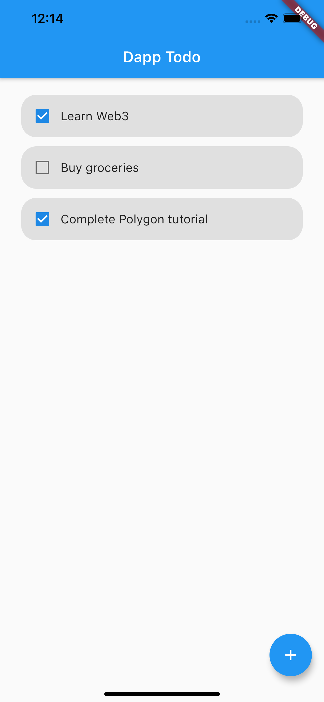

### ✨ Flutter でフロントを開発する（UI編）

FlutterのUI部分を構築するために、まず、2.`TodoList.dart`ファイルの中身を作成していきます。

`TodoList.dart`ファイルに、下記を追加してください。

```dart
//TodoList.dart
import 'package:flutter/material.dart';
import 'package:provider/provider.dart';
import 'package:todo_dapp_front/TodoBottomSheet.dart';
import 'package:todo_dapp_front/TodoListModel.dart';

class TodoList extends StatelessWidget {
  const TodoList({Key? key}) : super(key: key);

  @override
  Widget build(BuildContext context) {
    var listModel = Provider.of<TodoListModel>(context, listen: true);
    return Scaffold(
      appBar: AppBar(
        title: const Text("Dapp Todo"),
      ),
      floatingActionButton: FloatingActionButton(
        onPressed: () {
          showTodoBottomSheet(context);
        },
        child: const Icon(Icons.add),
      ),
      body: listModel.isLoading
          ? const Center(child: CircularProgressIndicator())
          : Column(
              children: [
                const SizedBox(height: 16),
                Expanded(
                  child: ListView.builder(
                    itemCount: listModel.todos.length,
                    itemBuilder: (context, index) => ListTile(
                      title: InkWell(
                        onTap: () {
                          showTodoBottomSheet(
                            context,
                            task: listModel.todos[index],
                          );
                        },
                        child: Container(
                          margin: const EdgeInsets.symmetric(
                            vertical: 2,
                            horizontal: 12,
                          ),
                          padding: const EdgeInsets.all(4),
                          decoration: BoxDecoration(
                            color: Colors.grey[300],
                            borderRadius: BorderRadius.circular(20),
                          ),
                          child: Row(
                            children: [
                              //チェックボックス
                              Checkbox(
                                value: listModel.todos[index].isCompleted,
                                onChanged: (val) {
                                  listModel.toggleComplete(
                                      listModel.todos[index].id!);
                                },
                              ),
                              //タスク名
                              Text(listModel.todos[index].taskName!),
                            ],
                          ),
                        ),
                      ),
                    ),
                  ),
                ),
              ],
            ),
    );
  }
}
```

それでは、詳しく見ていきましょう。

まず、Flutterアプリの画面構成については、[こちら](https://codezine.jp/article/detail/14064)をご覧ください。

```dart
//TodoList.dart
class TodoList extends StatelessWidget {
    ...
}
```
`StatelessWidget`クラスを継承した`TodoList`クラスを作成しています。

簡単に説明すると、`StatelessWidget`とは状態がずっと変化しないウィジェットのことです。

詳しくは[こちら](https://flutternyumon.com/flutter-statelesswidget-vs-statefulwidget/)をご覧ください。

```dart
//TodoList.dart
  Widget build(BuildContext context) {
    ...
  }
```

ビルド関数では、`TodoListModel`をリッスンして、それに応じてUIをレンダリングしています。

```dart
//TodoList.dart
    return Scaffold(
      appBar: AppBar(
        title: const Text("Dapp Todo"),
      ),
      floatingActionButton: FloatingActionButton(
        onPressed: () {
          showTodoBottomSheet(context);
        },
        child: const Icon(Icons.add),
      ),
      body: listModel.isLoading
          ? const Center(child: CircularProgressIndicator())
          : Column(
              children: [
                const SizedBox(height: 16),
                Expanded(
                  child: ListView.builder(
                    itemCount: listModel.todos.length,
                    itemBuilder: (context, index) => ListTile(
                      title: InkWell(
                        onTap: () {
                          showTodoBottomSheet(
                            context,
                            task: listModel.todos[index],
                          );
                        },
                        child: Container(
                          margin: const EdgeInsets.symmetric(
                            vertical: 2,
                            horizontal: 12,
                          ),
                          padding: const EdgeInsets.all(4),
                          decoration: BoxDecoration(
                            color: Colors.grey[300],
                            borderRadius: BorderRadius.circular(20),
                          ),
                          child: Row(
                            children: [
                              //チェックボックス
                              Checkbox(
                                value: listModel.todos[index].isCompleted,
                                onChanged: (val) {
                                  listModel.toggleComplete(
                                      listModel.todos[index].id!);
                                },
                              ),
                              //タスク名
                              Text(listModel.todos[index].taskName!),
                            ],
                          ),
                        ),
                      ),
                    ),
                  ),
                ),
              ],
            ),
    );
```

- `isLoading`フォームの`TodoListModel`が`true`ならば`Loading`ウィジェットをレンダリングし、そうでなければ`ListView`を作成して`TodoListModel`の`todos`の長さ分ループしています。

- `ListView`では、to-doの`isComplete`値を切り替えるためのチェックボックスと、タスク名のコンテナを返します。

- `floatingActionButton`は、to-doリストに新しいタスクを追加するためのボタンです。下の画像の右下にある＋アイコン。

下の画像のようなUIになります。



以上で、2.`TodoList.dart`ファイルの中身は完成しました。

次に、3.`TodoBottomSheet.dart`ファイルの中身を作成していきます。

`TodoBottomSheet.dart`ファイルに、下記を追加してください。

```dart
//TodoBottomSheet.dart
import 'package:flutter/material.dart';
import 'package:provider/provider.dart';
import 'package:todo_dapp_front/TodoListModel.dart';

showTodoBottomSheet(BuildContext context, {Task? task}) {
  TextEditingController _titleController =
      TextEditingController(text: task?.taskName ?? "");
  var listModel = Provider.of<TodoListModel>(context, listen: false);

  //タスクを作成、更新、削除できるボトムシートを表示する。
  return showModalBottomSheet<void>(
    shape: RoundedRectangleBorder(borderRadius: BorderRadius.circular(20)),
    context: context,
    builder: (BuildContext context) {
      return Container(
        padding: const EdgeInsets.only(top: 10),
        margin: const EdgeInsets.all(10),
        height: 300,
        child: SingleChildScrollView(
          child: Column(
            children: [
              Container(
                height: 6,
                width: 80,
                decoration: BoxDecoration(
                  color: Colors.grey,
                  borderRadius: BorderRadius.circular(20),
                ),
              ),
              const SizedBox(height: 18),
              TextField(
                controller: _titleController,
                decoration: const InputDecoration(
                  border: OutlineInputBorder(
                    borderRadius: BorderRadius.all(Radius.circular(20)),
                  ),
                  contentPadding: EdgeInsets.only(
                    left: 14.0,
                    bottom: 20.0,
                    top: 20.0,
                  ),
                  hintText: 'Enter a search term',
                  hintStyle: TextStyle(
                    fontSize: 20,
                  ),
                ),
                style: const TextStyle(
                  fontSize: 20,
                ),
              ),
              const SizedBox(height: 12),
              if (task == null)
                buildButton("Created", () {
                  listModel.addTask(_titleController.text);
                  Navigator.pop(context);
                }),
              if (task != null)
                buildButton("Updated", () {
                  listModel.updateTask(task.id!, _titleController.text);
                  Navigator.pop(context);
                }),
              if (task != null)
                buildButton("Delete", () {
                  listModel.deleteTask(task.id!);
                  Navigator.pop(context);
                }),
            ],
          ),
        ),
      );
    },
  );
}

//ボタンの具体的なデザインを設定する。
TextButton buildButton(String text, void Function()? onPressed) {
  return TextButton(
    onPressed: onPressed,
    child: Container(
      child: Center(
        child: Text(
          text,
          style: const TextStyle(
            color: Colors.white,
            fontSize: 20,
          ),
        ),
      ),
      height: 50,
      padding: const EdgeInsets.symmetric(vertical: 10),
      width: double.infinity,
      decoration: BoxDecoration(
        color: text == "Delete" ? Colors.red : Colors.blue,
        borderRadius: BorderRadius.circular(15),
      ),
    ),
  );
}
```

ここでは、`showTodoBottomSheet`と`buildButton`という2つの関数を作成しています。

それでは、詳しく見ていきましょう。

```dart
//TodoBottomSheet.dart
showTodoBottomSheet(BuildContext context, {Task? task}) {
  TextEditingController _titleController =
      TextEditingController(text: task?.taskName ?? "");
  var listModel = Provider.of<TodoListModel>(context, listen: false);
  return showModalBottomSheet<void>(
    shape: RoundedRectangleBorder(borderRadius: BorderRadius.circular(20)),
    context: context,
    builder: (BuildContext context) {
      return Container(
        padding: const EdgeInsets.only(top: 10),
        margin: const EdgeInsets.all(10),
        height: 300,
        child: SingleChildScrollView(
          child: Column(
            children: [
              Container(
                height: 6,
                width: 80,
                decoration: BoxDecoration(
                  color: Colors.grey,
                  borderRadius: BorderRadius.circular(20),
                ),
              ),
              const SizedBox(height: 18),
              TextField(
                controller: _titleController,
                decoration: const InputDecoration(
                  border: OutlineInputBorder(
                    borderRadius: BorderRadius.all(Radius.circular(20)),
                  ),
                  contentPadding: EdgeInsets.only(
                    left: 14.0,
                    bottom: 20.0,
                    top: 20.0,
                  ),
                  hintText: 'Enter a search term',
                  hintStyle: TextStyle(
                    fontSize: 20,
                  ),
                ),
                style: const TextStyle(
                  fontSize: 20,
                ),
              ),
              const SizedBox(height: 12),
              if (task == null)
                buildButton("Created", () {
                  listModel.addTask(_titleController.text);
                  Navigator.pop(context);
                }),
              if (task != null)
                buildButton("Updated", () {
                  listModel.updateTask(task.id!, _titleController.text);
                  Navigator.pop(context);
                }),
              if (task != null)
                buildButton("Delete", () {
                  listModel.deleteTask(task.id!);
                  Navigator.pop(context);
                }),
            ],
          ),
        ),
      );
    },
  );
}
```

`showTodoBottomSheet`は、ユーザーがタスクを作成、更新、削除できるボトムシートを表示します。

- オプションのパラメータ`task`を受け取り、`task`の値に基づいてボトムシートのUIをレンダリングしています。

`task`の値が`null`の場合は、新しいto-doタスクを作成するUIをレンダリングし、`null`でない場合は、更新および削除UIをレンダリングしています。

- 作成、更新、削除のボタンが押されると、`TodoListModel`クラスからそれぞれのスマートコントラクト関数が呼び出されます。

```dart
//TodoBottomSheet.dart
TextButton buildButton(String text, void Function()? onPressed) {
  return TextButton(
    onPressed: onPressed,
    child: Container(
      child: Center(
        child: Text(
          text,
          style: const TextStyle(
            color: Colors.white,
            fontSize: 20,
          ),
        ),
      ),
      height: 50,
      padding: const EdgeInsets.symmetric(vertical: 10),
      width: double.infinity,
      decoration: BoxDecoration(
        color: text == "Delete" ? Colors.red : Colors.blue,
        borderRadius: BorderRadius.circular(15),
      ),
    ),
  );
}
```

`buildButton`は、`showTodoBottomSheet`のボタンの具体的なデザインを返すウィジェットです。

ユーザーが`floatingActionButton`をタップすると、タスクの値を`null`として`showTodoBottomSheet`を呼び出し、ユーザーが`ListView`からタスク・アイテムをタップすると、ユーザーがタップしたタスク・オブジェクトをタスクの値として`showTodoBottomSheet`を呼び出します。

下の画像のようなUIになります。


以上で、3.`TodoBottomSheet.dart`ファイルの中身は完成しました。

それでは最後に、`main.dart`ファイルから`TodoList`ウィジェットを呼び出して、アプリをレンダリングします。

`main.dart`ファイルを、下記のように更新してください。

```dart
//main.dart
import 'package:flutter/material.dart';
import 'package:provider/provider.dart';
import 'package:todo_dapp_front/TodoList.dart';
import 'package:todo_dapp_front/TodoListModel.dart';

void main() {
  runApp(MyApp());
}

class MyApp extends StatelessWidget {
  @override
  Widget build(BuildContext context) {
    return ChangeNotifierProvider(
      create: (context) => TodoListModel(),
      child: const MaterialApp(
        title: 'Flutter TODO',
        home: TodoList(),
      ),
    );
  }
}
```

以上で、フロントの開発は完了です。

### 🙋‍♂️ 質問する

ここまでの作業で何かわからないことがある場合は、Discordの`#polygon`で質問をしてください。

ヘルプをするときのフローが円滑になるので、エラーレポートには下記の3点を記載してください ✨

```
1. 質問が関連しているセクション番号とレッスン番号
2. 何をしようとしていたか
3. エラー文をコピー&ペースト
4. エラー画面のスクリーンショット
```

---
あなたのUIをスクリーンショットしてDiscordの`#polygon`に投稿してましょう!

次のセクションに進んで、スマートコントラクトをMumbai testnetに公開しましょう 🎉
