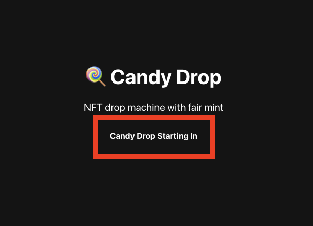
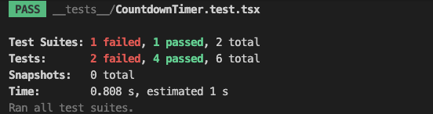
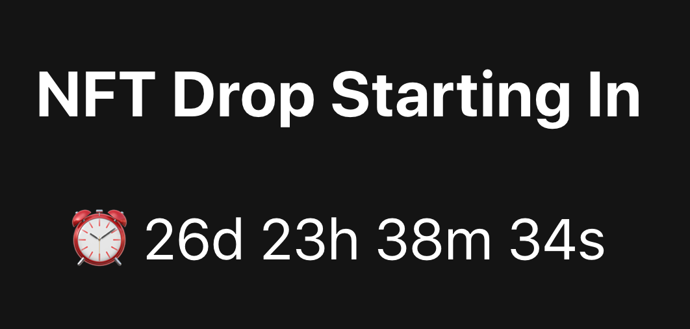
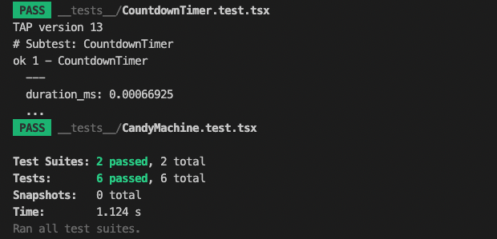
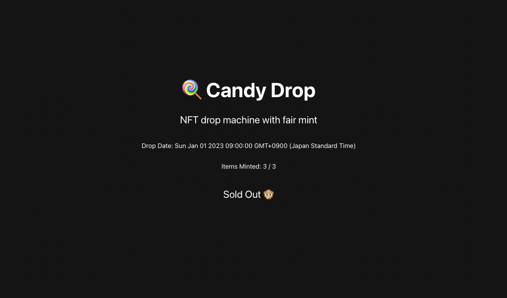

### ⏳ ドロップタイマーの作成

ドロップ開始日までのカウントダウンタイマーを追加してみましょう。

今のところ、日付を過去に設定しているので、「ドロップ」はすでに発生しています。`config.json`ファイルを開き、`startDate`を未来の日付に変更しましょう。

```json
// config.json
  "guards": {
    "default": {
      "solPayment": {
        "value": 0.1,
        "destination": "WALLET_ADDRESS_TO_PAY_TO"
      },
      "startDate": {
        "date": "2024-01-01T00:00:00Z"
      }
    }
  }
```

`config.json`の修正を反映させるため、下記のコマンドを実行しましょう。

```
sugar guard update
```

次のようなエラーが発生した場合は以下のように対応してください。

```
🛑 Error running command (re-run needed): Cache file 'cache.json' not found. Run `sugar upload` to create it or provide it with the --cache option.
```

上記はコマンドがCandy MachineとNFT周辺の重要なデータを含む`cache.json`ファイルにアクセスできないことを意味します。

Solana-NFT-Dropフォルダのルートに存在する`cache.json`ファイル、`assets`フォルダと同じディレクトリからコマンドを実行していることを確認してください。

設定が反映されていることを`sugar guard show`コマンドで確認しましょう。start dateが更新されていたら再設定は完了です。

カウントダウンタイマーを設定するにあたり、下記を実装します。

- 設定したドロップ日が、現在の日時より先（未来）の場合にのみ表示される

- 1秒ごとにカウントダウンする「カウントダウン」スタイルのタイマーを実装

Webアプリケーションのコードをクリーンに保つため、タイマーの状態とロジックを処理する別のコンポーネントを作成します。

`components/CountdownTimer`フォルダをすでに作成してあります。

そこに`index.tsx`ファイルを作成し、次のコードを追加します。

```jsx
// CountdownTimer/index.tsx
import { useEffect, useState } from 'react';

import CountdownTimerStyles from './CountdownTimer.module.css';

type CountdownTimerProps = {
  dropDate: Date;
};

const CountdownTimer = (props: CountdownTimerProps) => {
  const { dropDate } = props;

  // State
  const [timerString, setTimerString] = useState('');

  return (
    <div className={CountdownTimerStyles.timerContainer}>
      <p className={CountdownTimerStyles.timerHeader}>
        {' '}
        Candy Drop Starting In{' '}
      </p>
      {timerString && (
        <p className={CountdownTimerStyles.timerValue}>
          {' '}
          {`⏰ ${timerString}`}{' '}
        </p>
      )}
    </div>
  );
};

export default CountdownTimer;
```

ここでは、タイマーに表示する日時を保持するステートを持つシンプルなReactコンポーネントを設定し、`dropDate`を取り込みます。

先へ進む前に、`components/CandyMachine/index.tsx`に移動して、このコンポーネントをインポートしましょう。

```jsx
// CandyMachine/index.tsx
// 追加
import CountdownTimer from '@/components/CountdownTimer';
```

カウントダウンタイマーをいつ表示するかを処理するロジックを実装します。

現在の日付がドロップ日の**前**である場合にのみ、CountdownTimerコンポーネントを表示します。ドロップ日時がすぎている場合は、ドロップ開始の日時を表示します。

`mintToken`関数の下に下記の関数を記述しましょう。

```jsx
// CandyMachine/index.tsx
// レンダリング関数を作成します。
const renderDropField = (
  candyMachine: CandyMachineType,
  candyGuard: CandyGuardType,
) => {
  const startDate: Option<StartDateType> = candyGuard.guards.startDate;
  if (startDate.__option === 'None') {
    return;
  }

  // JavaScriptのDateオブジェクトで現在の日付とDropDateを取得します。
  const currentDate = new Date();
  const dropDate = new Date(Number(startDate.value.date) * 1000);

  // 現在の日付がドロップ日よりも前の場合、CountdownTimerコンポーネントをレンダリングします。
  if (currentDate < dropDate) {
    return <CountdownTimer dropDate={dropDate} />;
  }

  // 現在の日付がドロップ日よりも後の場合、ドロップ日をレンダリングします。
  return (
    <>
      <p>{`Drop Date: ${dropDate}`}</p>
      <p>
        {' '}
        {`Items Minted: ${candyMachine.itemsRedeemed} / ${candyMachine.data.itemsAvailable}`}
      </p>
      <button
        className={`${styles.ctaButton} ${styles.mintButton}`}
        onClick={() => mintToken(candyMachine, candyGuard)}
        disabled={isMinting}
      >
        Mint NFT
      </button>
    </>
  );
};
```

[Mint NFT]ボタンのレンダリングを、ドロップ日になったら表示するようにしました。

CandyMachineコンポーネントのreturn文を下記の内容で更新して、`renderDropField`関数を呼び出すようにしましょう。

```jsx
// CandyMachine/index.tsx
return candyMachine && candyGuard ? (
  <div className={candyMachineStyles.machineContainer}>
    {renderDropField(candyMachine, candyGuard)}
  </div>
) : null;
```

条件付きレンダリングを使用して、コンポーネントのレンダリング関数を
呼び出しています。

ページを更新して、UIが反映されているか確認しましょう。



`CountdownTimer`コンポーネントに戻って、残りのロジックを実装します。タイマーのカウントダウンをリアルタイムで確認できるようにしましょう。

下記のコードをuseState定義の下に追加しましょう。

```jsx
// CountdownTimer/index.tsx
const [timerString, setTimerString] = useState('');

// 下記を追加します。
// useEffectはコンポーネントのロード時に実行されます。
useEffect(() => {
  // setIntervalを使用して、このコードの一部を1秒ごとに実行します。
  const intervalId = setInterval(() => {
    const currentDate = new Date().getTime();
    const distance = dropDate.getTime() - currentDate;

    // 時間の計算をするだけで、さまざまなプロパティを得ることができます。
    const days = Math.floor(distance / (1000 * 60 * 60 * 24));
    const hours = Math.floor(
      (distance % (1000 * 60 * 60 * 24)) / (1000 * 60 * 60),
    );
    const minutes = Math.floor((distance % (1000 * 60 * 60)) / (1000 * 60));
    const seconds = Math.floor((distance % (1000 * 60)) / 1000);

    // 得られた出力結果を設定します。
    setTimerString(`${days}d ${hours}h ${minutes}m ${seconds}s`);

    // distanceが0になったらドロップタイムが来たことを示します。
    if (distance < 0) {
      clearInterval(intervalId);
      setTimerString('');
    }
  }, 1000);

  // コンポーネントが取り外されたときには、intervalを初期化しましょう。
  return () => {
    if (intervalId) {
      clearInterval(intervalId);
      setTimerString('');
    }
  };
}, []);
```

ロジックを実装したので、テストスクリプトを実行して模擬的に動作確認をしてみましょう。CountdownTimerコンポーネントのテストスクリプトは、`__tests__/CountdownTimer.test.tsx`です。

簡単にテストスクリプトの内容を確認していきましょう。

`beforeEach`、`afterEach`は各テストの前と後に実行される関数です。

```jsx
beforeEach(() => {
  // タイマー関数をモックする
  jest.useFakeTimers();
  jest.spyOn(global, 'clearInterval');
});

afterEach(() => {
  jest.clearAllTimers();
});
```

タイマー関数は実時間経過に依存するため、テスト環境としてはあまり理想的ではありません。そのため、時間の経過をコントロールできる関数と入れ替えることができます。`beforeEach`では、`jest.useFakeTimers()`を使用して、偽タイマーを有効にします。これにより、CountdownTimerコンポーネント内で使用しているタイマー関数をモックすることができます。

モック（Mock）という言葉は、実際のものや状況を「模倣」するものを指します。

テストにおいては、実際のオブジェクトや関数の代わりに使用される模擬的なオブジェクトや関数を指します。これにより、テスト対象のコードとそれ以外の部分（コンポーネントの外から渡されるデータや外部モジュールなど）を分離し、テスト対象のコードのみを独立してテストできるようになります。

`afterEach`では、`jest.clearAllTimers()`を使用して、テスト中に実行されたすべてのタイマーをクリアします。

`describe`以降が実行されるテスト内容になります。ここでは3つのテストを行なっています。

1\. **ドロップ日までのカウントダウンが表示されるか**

CountdownTimerコンポーネントに渡したい`dropDate`を設定します。ここでは、現在の日付から1分後に設定しています。

```jsx
it('should render the countdown timer', async () => {
  /** 準備 */
  /** ドロップ開始時間を、現在の時刻から1分後に設定する */
  const dropDate = new Date(Date.now() + 1000 * 60 * 1);

  render(<CountdownTimer dropDate={dropDate} />);
```

偽タイマーの値を1秒進めて、表示が期待される要素を取得します。

```jsx
act(() => {
  /** 1秒タイマーを進める */
  jest.advanceTimersByTime(1000);
});

/** 実行 */
const textElement = screen.getByText(/Candy Drop Starting In/);
const textTimerElement = screen.getByText(/⏰ 0d 0h 0m 59s/);
```

最後に、表示されているかどうかを確認します。

```jsx
/** 確認 */
expect(textElement).toBeInTheDocument();
expect(textTimerElement).toBeInTheDocument();
```

2\. **ドロップ日が過ぎたらタイマーは表示されないか**

今度は、ドロップ日を現在の日付から1秒後に設定します。タイマーを進めてドロップ日が過ぎた状況を再現します。ここまでは先ほどのテストと同じです。

最後の確認で、タイマーが表示されていないこと・clearIntervalが呼び出されていることを確認します。

```jsx
/** 確認 */
const textElement = screen.queryByText(/⏰/)

expect(textElement).toBeNull();
expect(clearInterval).toHaveBeenCalled();
```

3\. **コンポーネントがアンマウントされた時にclearIntervalが呼び出されるか**

最後のテストでは、コンポーネントがアンマウントされた時にclearIntervalが呼び出されるかを確認します。

```jsx
const { unmount } = render(<CountdownTimer dropDate={dropDate} />);

/** コンポーネントをアンマウントする */
unmount();

expect(clearInterval).toHaveBeenCalled();
```

では、実際にテストを実行してみましょう。

```
yarn test
```

この時点でCountdownTimerコンポーネントのテストにパスし、`Test Suites:`の表示が`1 passed`となっていたら実装完了です。




実際にブラウザでも表示を確認してみましょう。



以上です。

シンプルなカウントダウンタイマーを実装しました。


### 📭「売り切れ」状態を構築する

すべてのNFTをミントしきった際、「Sold Out」を表示する機能を実装します。

これは、`candyMachine`の`itemsRedeemed`と`data.itemsAvailable`の2つのプロパティをチェックすることで実装が可能になります。

`CandyMachine`コンポーネントのレンダリング関数を修正しましょう。renderDropField関数内最後のreturn文を下記のように更新します。

```jsx
// CandyMachine/index.tsx
const renderDropField = (candyMachine: CandyMachineType, startDate: Option<StartDateType>) => {

  ...

  // 現在の日付がドロップ日よりも後の場合、ドロップ日をレンダリングします。
  return (
    <>
      <p>{`Drop Date: ${dropDate}`}</p>
      <p>
        {' '}
        {`Items Minted: ${candyMachine.itemsRedeemed} / ${candyMachine.data.itemsAvailable}`}
      </p>
      {candyMachine.itemsRedeemed === candyMachine.data.itemsAvailable ? (
        <p className={styles.subText}>Sold Out 🙊</p>
      ) : (
        <button
          className={`${styles.ctaButton} ${styles.mintButton}`}
          onClick={() => mintToken(candyMachine, candyGuard)}
          disabled={isMinting}
        >
          Mint NFT
        </button>
      )}
    </>
  );
};
```

`candyMachine.itemsRedeemed === candyMachine.data.itemsAvailable`の条件に一致した場合は"Sold Out 🙊"をレンダリングします。そうでない場合は、[Mint NFT]ボタンをレンダリングするようにコードを更新しました。

それでは、テストスクリプトを実行して模擬的に動作確認をしてみましょう。CandyMachineコンポーネントのテストスクリプトは、`__tests__/CandyMachine.test.tsx`です。

簡単にテストスクリプトの内容を確認していきましょう。テスト内容としては、Candy Machine/Candy Guardの状態に応じて、表示される内容が正しいかどうかを確認しています。そのため、Solanaネットワークとやり取りを行うモジュールをモックしています。

```jsx
// __tests__/CandyMachine.test.tsx
jest.mock('@metaplex-foundation/mpl-candy-machine', () => ({
  fetchCandyMachine: jest.fn(),
  safeFetchCandyGuard: jest.fn(),
  mplCandyMachine: jest.fn(),
}));

jest.mock('@metaplex-foundation/mpl-essentials', () => ({
  setComputeUnitLimit: jest.fn(),
}));

// === 以下省略 ===

```

テストを行う状況は、3つあります。

1\. ドロップ日が未来に設定されている場合

2\. NFTがミントできる場合

3\. NFTが売り切れの場合

それぞれの状況に合わせて、テストではCandy MachineとCandy Guardの設定を変更しています。

**1\. ドロップ日が未来に設定されている場合**のテストを見てみましょう。Candy Machineの設定を指定するために、fetchCandyMachine関数をモックして戻り値に`mockCandyMachineData`オブジェクトを設定しています。Candy Guardの設定も同様です。モックした関数の戻り値に`mockCandyGuardFutureData`オブジェクトを設定します。

```jsx
describe('when drop date is in the future', () => {
  /** fetchCandyMachine関数の戻り値を設定します */
  (fetchCandyMachine as jest.Mock).mockImplementationOnce(() =>
    Promise.resolve({
      ...mockCandyMachineData,
    }),
  );
  /** safeFetchCandyGuard関数の戻り値を設定して、ドロップ日を現在時刻の1日後に設定します */
  (safeFetchCandyGuard as jest.Mock).mockImplementationOnce(() =>
    Promise.resolve({
      ...mockCandyGuardFutureData,
    }),
  );
```

CandyMachineコンポーネントのレンダリング処理を行い、要素が取得できる状態にします。

```jsx
await act(async () => {
  render(<CandyMachine walletAddress={'mockAddress'} />);
});
```

最後に確認を行います。今回のテストの場合は、ドロップ日が未来に設定されているので下記を期待する動作とします。

- CountdownTimerコンポーネントが呼び出されているか
- Mint NFTボタンは表示されていないか

```jsx
/** CountdownTimerコンポーネントが呼び出されているか */
// CountdownTimerコンポーネントがレンダリングする`Candy Drop Starting In`テキストが存在するかどうかで確認をしています。
const textElement = screen.getByText(/Candy Drop Starting In/);
expect(textElement).toBeInTheDocument();
/** Mint NFTボタンは表示されていないか */
const buttonElement = screen.queryByRole('button', {
  name: /Mint NFT/i,
});
expect(buttonElement).not.toBeInTheDocument();
```

**2\. NFTがミントできる場合**では、Mint NFTボタンが表示されているかを確認します。

**3\. NFTが売り切れの場合**では、Sold Out 🙊が表示されているか、Mint NFTボタンが表示されていないかを確認します。

それでは、実際にテストを実行してみましょう。

```
yarn test
```

すべてのテストにパスしていたら、実装完了です。



実際にブラウザでも表示を確認してみましょう。

下記の画像は、NFTがすべてミントされた時に期待される表示です。



### 🙋‍♂️ 質問する

ここまでの作業で何かわからないことがある場合は、Discordの`#solana`で質問をしてください。

ヘルプをするときのフローが円滑になるので、エラーレポートには下記の3点を記載してください ✨

```
1. 質問が関連しているセクション番号とレッスン番号
2. 何をしようとしていたか
3. エラー文をコピー&ペースト
4. エラー画面のスクリーンショット
```

---

次のレッスンに進んで、VercelにWebアプリケーションをデプロイしましょう 🎉
