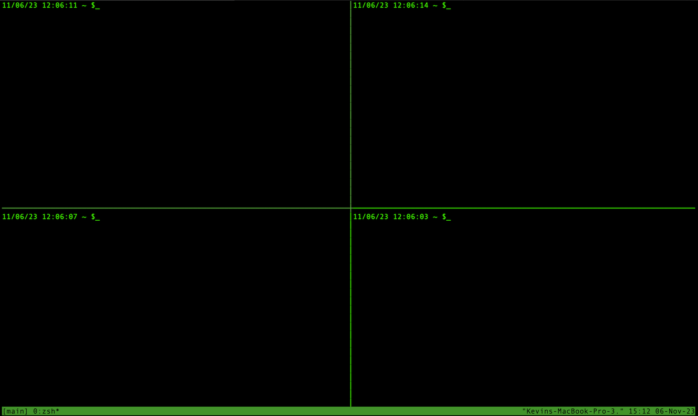
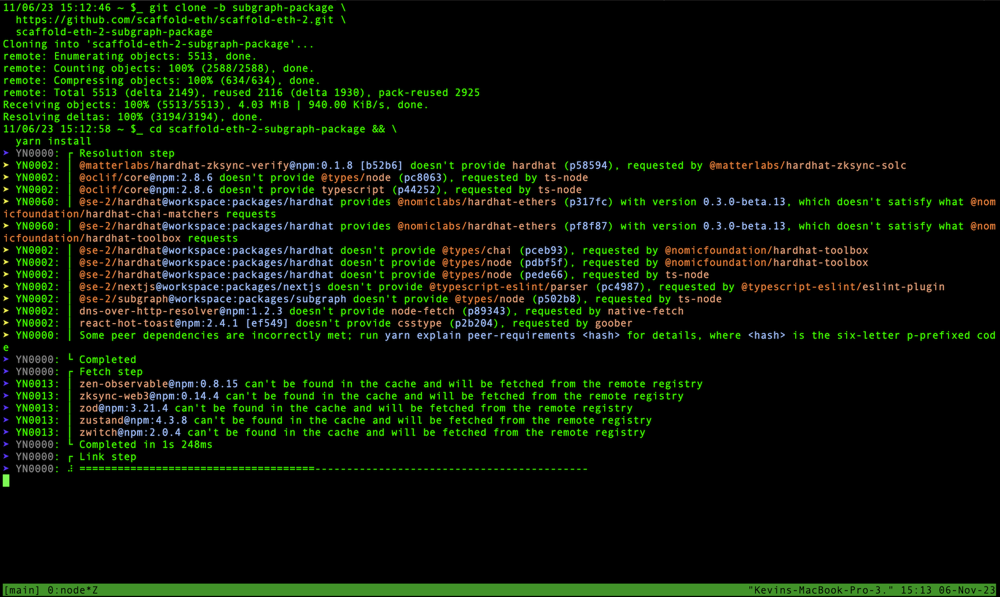
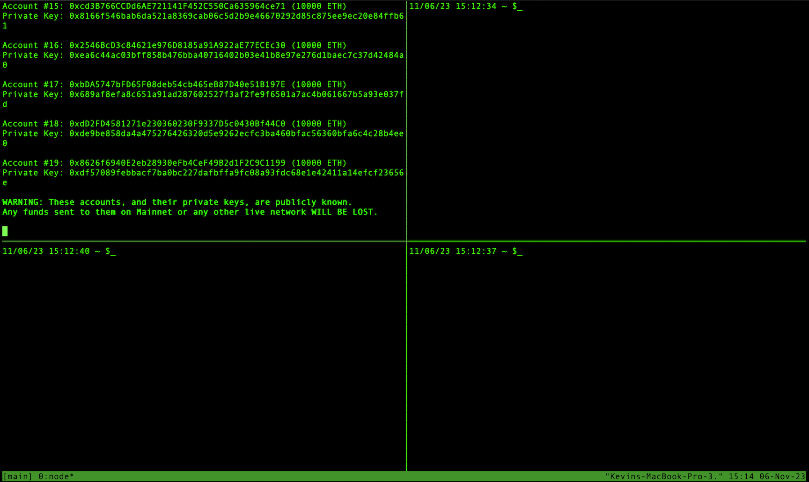
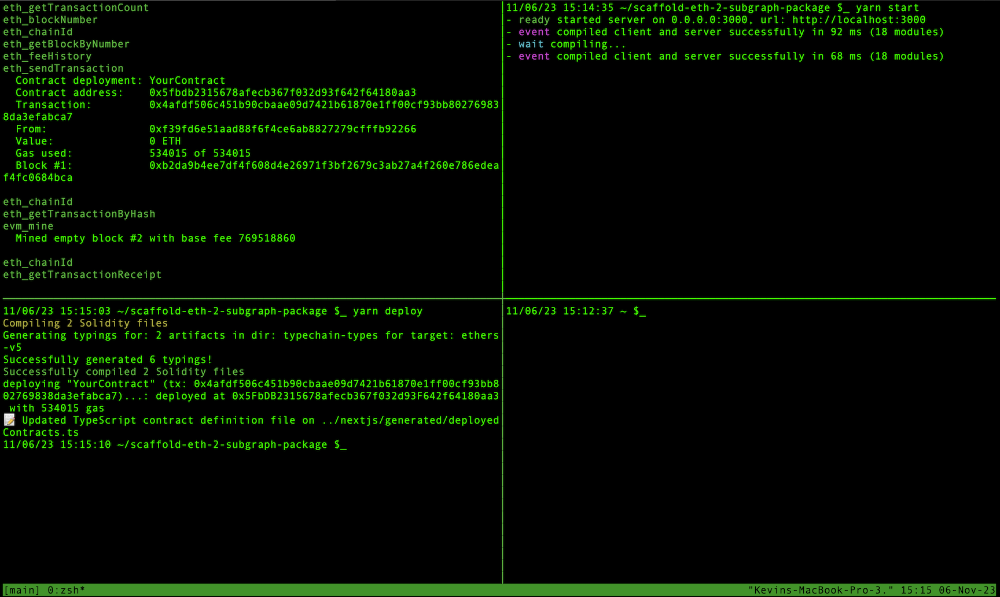
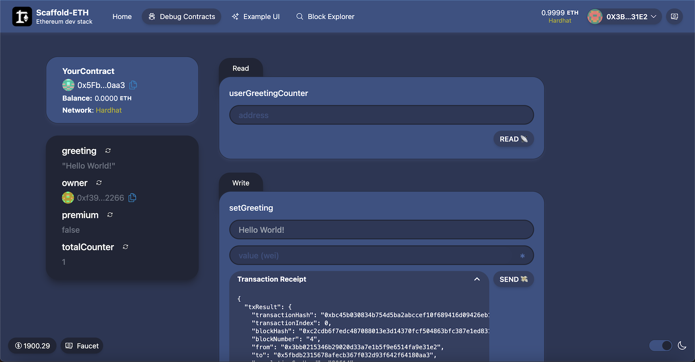

## Scaffold-ETH 2 のセットアップ

### 🖥️ サブグラフパッケージのセットアップ

まず、Edge and NodeのSimonが作成したScaffold-ETH 2の特別なビルドを使って始めましょう。ありがとう、Simon! 🫡

Scaffold-ETH 2とThe Graphをセットアップするために、合計4つの異なるウィンドウが必要になります。



```
git clone -b subgraph-package \
  https://github.com/scaffold-eth/scaffold-eth-2.git \
  scaffold-eth-2-subgraph-package
```

これをあなたのマシンにチェックアウトしたら、ディレクトリに移動し、yarnを使用してすべての依存関係をインストールします。

```
cd scaffold-eth-2-subgraph-package && \
  yarn install
```



次に、スマートコントラクトをデプロイしてテストするために、ローカルブロックチェーンを起動する必要があります。Scaffold-ETH 2はデフォルトでHardhatを使用しています。チェーンを起動するには、次のyarnコマンドを入力します。

```
yarn chain
```



> このウィンドウを開いたままにしておくと、hardhat コンソールからの出力を確認できます。🖥️

次に、フロントエンドアプリケーションを起動します。Scaffold-ETH 2はデフォルトでNextJSを使用しており、単純なyarnコマンドで起動することもできます。新しいコマンドラインを開き、次のコマンドを入力します。

```
yarn start
```


> このウィンドウも常に開いておくと、NextJS に加えたコード変更のデバッグ、パフォーマンスのチェック、またはサーバーが適切に動作しているかを確認できます。

次に、スマートコントラクトをデプロイするための第三のウィンドウを開きます。Scaffold-ETHには他にも便利なコマンドがあります。デプロイを行うには、単に以下を実行します…

```
yarn deploy
```



> デプロイにかかったガスの量と共に、トランザクションとアドレスが表示されるはずです。⛽

http://localhost:3000 にアクセスすると、NextJSアプリケーションが表示されます。Scaffold-ETH 2のメニューや機能を探索してみましょう！ 緊急事態ですね、これはすごい！ 🔥

setGreeting関数にアップデートを送信してテストすることができます。これを行うには、右上のバーナーウォレットアドレスの隣にある現金アイコンをクリックしてガスを入手する必要があります。これにより、フォーセットから1 ETHが送られます。

次に、「Debug Contracts」に移動し、setGreetingの下の文字列フィールドをクリックしてお好きな文字を入力し、「SEND」をクリックします。



これが完了すると、成功したことを確認するために展開できるTransaction Receiptが表示されます。
