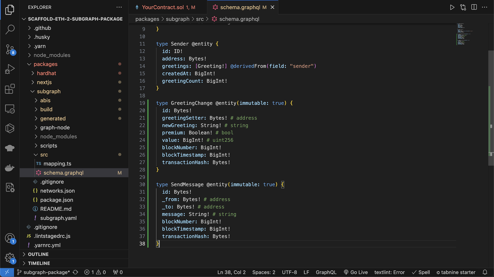
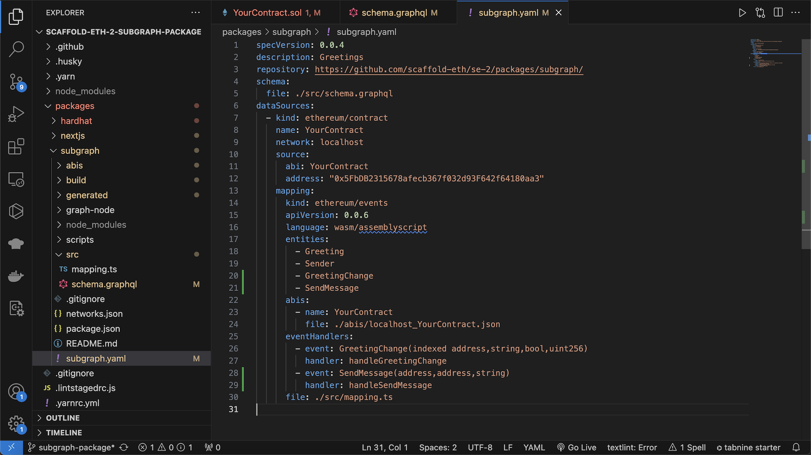
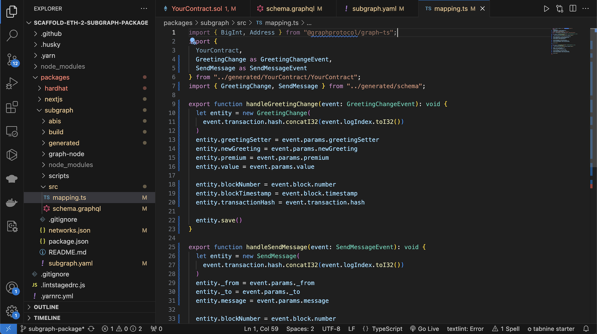

## サブグラフの更新

### ✅ GraphQL スキーマの更新

スマートコントラクトにイベントを追加した後、まずGraphQLスキーマを更新して、Graphノードに保存したいエンティティを含める必要があります。エンティティについての情報は[こちら](https://thegraph.com/docs/en/developing/creating-a-subgraph/#defining-entities)のドキュメントが参考になります。

以下のコードでは、既存のスキーマをイベント名に合わせた新しい命名規則に更新します。

> スキーマファイルは、packages/subgraph/src/schema.graphql にあります。

```
// 既存のコード下に追加
type GreetingChange @entity(immutable: true) {
  id: Bytes!
  greetingSetter: Bytes! # address
  newGreeting: String! # string
  premium: Boolean! # bool
  value: BigInt! # uint256
  blockNumber: BigInt!
  blockTimestamp: BigInt!
  transactionHash: Bytes!
}

type SendMessage @entity(immutable: true) {
  id: Bytes!
  _from: Bytes! # address
  _to: Bytes! # address
  message: String! # string
  blockNumber: BigInt!
  blockTimestamp: BigInt!
  transactionHash: Bytes!
}

```



#### ✅ サブグラフマニフェストの更新

これらのエンティティをサブグラフYAML構成に追加し、イベントハンドラも追加する必要があります。

> このファイルは、packages/subgraph/subgraph.yaml にあります。

```
entities:
        - Greeting
        - Sender
        - GreetingChange
        - SendMessage
```

```
      eventHandlers:
        - event: GreetingChange(indexed address,string,bool,uint256)
          handler: handleGreetingChange
        - event: SendMessage(address,address,string)
          handler: handleSendMessage
```



ここまでステップ通りに進んでいる場合は、次に新しいabiをコピーしてコードを再生成する必要があります。

```
yarn abi-copy && yarn codegen
```


#### ✅ マッピングスクリプトの更新

次に、先ほど編集したファイルのマッピングを更新する必要があります。

> このファイルは、packages/subgraph/src/mapping.ts にあります。

```
import {
  YourContract,
  GreetingChange as GreetingChangeEvent,
  SendMessage as SendMessageEvent
} from "../generated/YourContract/YourContract";
```

スキーマも更新します。

```
import { GreetingChange, SendMessage } from "../generated/schema"
```

最後に、各イベントのマッピング関数を追加する必要があります。

```
export function handleGreetingChange(event: GreetingChangeEvent): void {
  let entity = new GreetingChange(
    event.transaction.hash.concatI32(event.logIndex.toI32())
  )
  entity.greetingSetter = event.params.greetingSetter
  entity.newGreeting = event.params.newGreeting
  entity.premium = event.params.premium
  entity.value = event.params.value

  entity.blockNumber = event.block.number
  entity.blockTimestamp = event.block.timestamp
  entity.transactionHash = event.transaction.hash

  entity.save()
}

export function handleSendMessage(event: SendMessageEvent): void {
  let entity = new SendMessage(
    event.transaction.hash.concatI32(event.logIndex.toI32())
  )
  entity._from = event.params._from
  entity._to = event.params._to
  entity.message = event.params.message

  entity.blockNumber = event.block.number
  entity.blockTimestamp = event.block.timestamp
  entity.transactionHash = event.transaction.hash

  entity.save()
}

```

この変更により、エディタ内でのリントエラーは消えるでしょう。



これでほぼ完成です... あとは公開するだけ！
